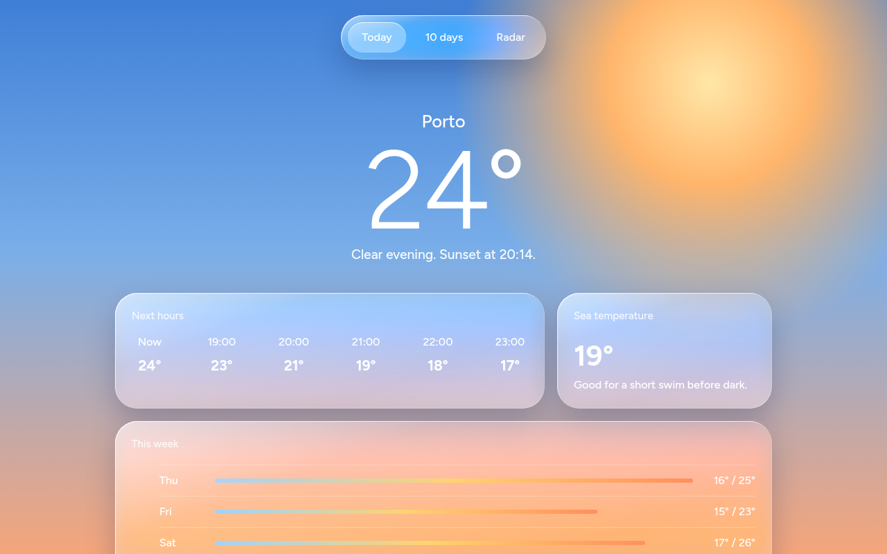

# Liquid Glass CSS Template (Free)



**Live demo:** https://mmrahmanbappi.github.io/100-css-designs/01-soft-tactile-ui/002-liquid-glass/demo.html
**Details and code:** https://mmrahmanbappi.github.io/100-css-designs/01-soft-tactile-ui/002-liquid-glass/

Free liquid glass UI template in pure CSS, inspired by the Apple 2025 design style. Glossy panels, light edges and pill buttons. Live demo and HTML download.

## What is liquid glass?

Liquid glass is the look Apple introduced across its devices in 2025. Panels feel thicker and wetter than normal frosted glass. Their edges catch the light, they bend the colors behind them a little, and buttons sit in soft pill shapes.

You can get very close to it with CSS. The trick is layering: a blur and saturation boost behind the panel, bright inset shadows along the top and left edges, and a faint highlight on top that makes the surface look curved.

## What you get

- Glossy panels with light catching edges
- Floating pill tab bar with a working selected state
- Large thin temperature number as the hero
- Warm evening sky made only with gradients
- Hourly forecast that scrolls sideways on small screens

## The key CSS

```css
.liquid-glass {
  border-radius: 32px;
  background: linear-gradient(135deg, rgba(255,255,255,.28), rgba(255,255,255,.06));
  backdrop-filter: blur(14px) saturate(180%) brightness(1.1);
  box-shadow:
    inset 1px 1px 0 rgba(255,255,255,.75),
    inset -1px -1px 0 rgba(255,255,255,.2),
    inset 0 0 20px rgba(255,255,255,.15),
    0 18px 40px rgba(20,40,90,.25);
}
```

## How to use

1. Download `demo.html` from this folder.
2. Change the text, colors and links.
3. Upload it anywhere. One file, no build step.

## License

MIT. Free for personal and commercial use.
