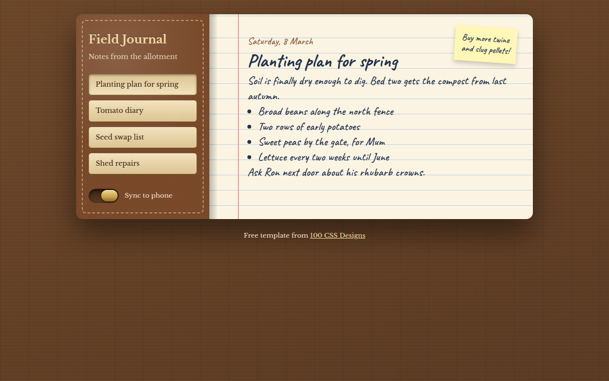

# Skeuomorphism CSS Template (Free)



**Live demo:** https://mmrahmanbappi.github.io/100-css-designs/01-soft-tactile-ui/007-skeuomorphism/demo.html
**Details and code:** https://mmrahmanbappi.github.io/100-css-designs/01-soft-tactile-ui/007-skeuomorphism/

Free skeuomorphism design template for a notes app. Leather cover, stitching, lined paper and a brass switch, all in pure CSS. Live demo and download.

## What is skeuomorphism?

Skeuomorphism makes screens look like real objects. Early iPhone apps used it everywhere: notes on yellow paper, calendars in leather, bookshelves made of wood. After years of flat design, it is coming back, because people miss interfaces with a bit of character.

This template draws every texture with CSS gradients. The wood grain, the leather, the dashed stitching, the lined paper and the red margin line are all code. There is not a single image file.

## What you get

- Wood desk background made with repeating gradients
- Leather cover with stitched border
- Lined notebook paper with a margin line
- Brass toggle switch that slides
- Handwritten Caveat font and a sticky note

## The key CSS

```css
.page {
  background:
    linear-gradient(90deg, transparent 60px, #e39a9a 60px 62px, transparent 62px),
    repeating-linear-gradient(transparent 0 31px, #b8cfe0 31px 32px),
    #fbf4e2;
}

.cover::before {
  content: ""; position: absolute; inset: 12px;
  border: 2px dashed rgba(243, 220, 180, 0.55); border-radius: 8px;
}
```

## How to use

1. Download `demo.html` from this folder.
2. Change the text, colors and links.
3. Upload it anywhere. One file, no build step.

## License

MIT. Free for personal and commercial use.
