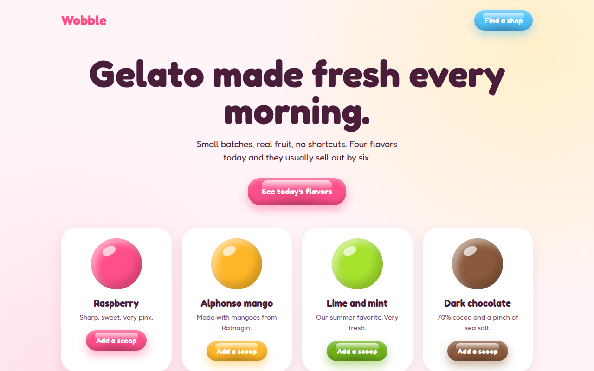

# Jelly UI CSS Template (Free)



**Live demo:** https://mmrahmanbappi.github.io/100-css-designs/01-soft-tactile-ui/009-jelly-ui/demo.html
**Details and code:** https://mmrahmanbappi.github.io/100-css-designs/01-soft-tactile-ui/009-jelly-ui/

Free jelly UI template with glossy buttons that wobble on hover and squish on click. Pure CSS gelato shop page with live demo and HTML download.

## What is jelly ui?

Jelly UI makes buttons look like shiny gummy sweets. They have a glossy highlight on top, a darker bottom and a little wobble when you move your mouse over them. Press one and it squishes flat for a moment.

The shine is a pseudo element with a white gradient. The wobble is a short keyframe animation that stretches the button wide and then tall. The squish is a simple scale on the active state.

## What you get

- Glossy jelly buttons in five colors from one CSS class
- Wobble on hover and squish on press
- Shiny 3D scoops made with radial gradients
- Color set per button with one CSS variable
- Wobble stops for people who prefer reduced motion

## The key CSS

```css
.jelly::before {
  content: ""; position: absolute; top: 5px; left: 14%; right: 14%; height: 38%;
  border-radius: 20px;
  background: linear-gradient(rgba(255,255,255,.75), rgba(255,255,255,0));
}
.jelly:hover { animation: wob .6s; }

@keyframes wob {
  30% { transform: scale(1.12, .88); }
  50% { transform: scale(.92, 1.08); }
  70% { transform: scale(1.04, .96); }
}
```

## How to use

1. Download `demo.html` from this folder.
2. Change the text, colors and links.
3. Upload it anywhere. One file, no build step.

## License

MIT. Free for personal and commercial use.
