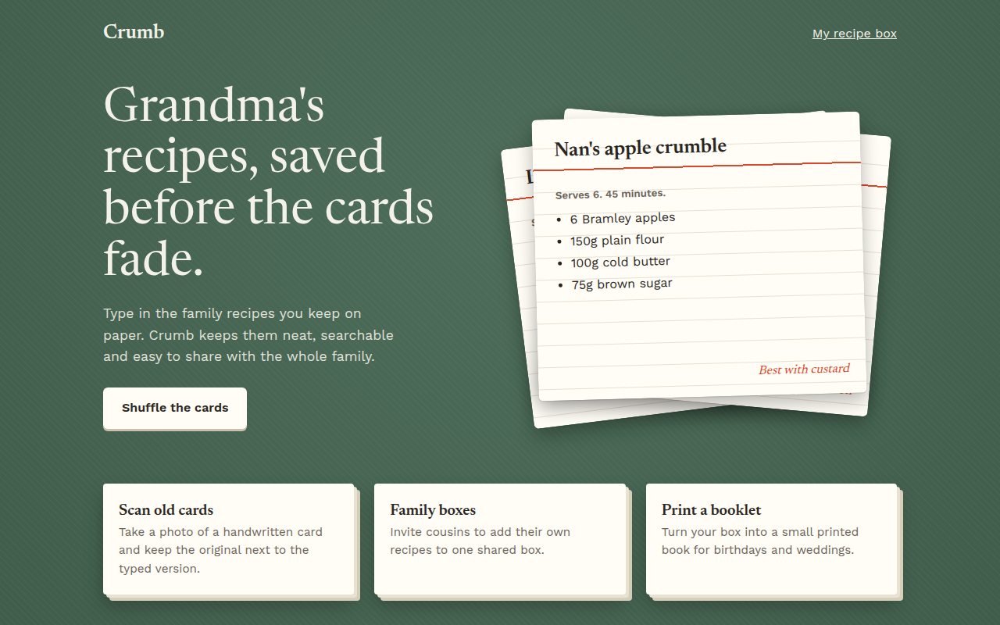

# Paper Stack CSS Template (Free)



**Live demo:** https://mmrahmanbappi.github.io/100-css-designs/01-soft-tactile-ui/010-paper-stack/demo.html
**Details and code:** https://mmrahmanbappi.github.io/100-css-designs/01-soft-tactile-ui/010-paper-stack/

Free paper stack card template in CSS. Layered index cards on a table with a shuffle button, built for a recipe website. Live demo and HTML download.

## What is paper stack?

Paper stack design shows content as real sheets of paper piled on a table. Cards sit at slight angles, each with its own shadow, and the pile looks like someone just put it down.

Each card is rotated a few degrees with transform and placed on top of the others. A shuffle button moves the top card to the bottom, and a CSS transition makes the pile settle smoothly.

## What you get

- Three index cards stacked at different angles
- Shuffle button that brings the next card to the top
- Lined card paper with a red header line
- Smaller cards with a layered paper edge
- Green table background with a subtle texture

## The key CSS

```css
.card { position: absolute; inset: 0; margin: auto;
  box-shadow: 0 10px 24px rgba(0,0,0,.28);
  transition: transform .45s cubic-bezier(.2,.8,.2,1); }

.card:nth-child(1) { transform: rotate(-7deg) translate(-26px, 14px); }
.card:nth-child(2) { transform: rotate(5deg) translate(22px, 6px); }
.card:nth-child(3) { transform: rotate(-1.5deg); }

.mini { box-shadow: 4px 4px 0 #e9e2d2, 8px 8px 0 #d8cfbb; }
```

## How to use

1. Download `demo.html` from this folder.
2. Change the text, colors and links.
3. Upload it anywhere. One file, no build step.

## License

MIT. Free for personal and commercial use.
