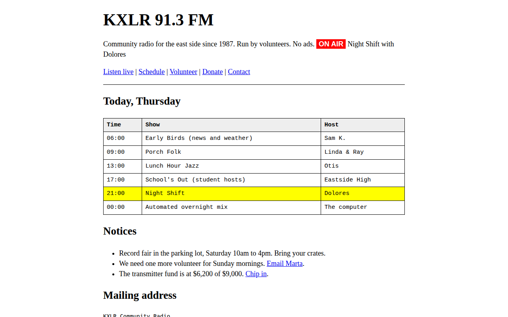

# Raw Brutalist CSS Template (Free)



**Live demo:** https://mmrahmanbappi.github.io/100-css-designs/02-bold-raw/012-raw-brutalist/demo.html
**Details and code:** https://mmrahmanbappi.github.io/100-css-designs/02-bold-raw/012-raw-brutalist/

Free raw brutalist website template with system fonts, blue links and a plain HTML look. Fast, honest and easy to edit. Live demo and HTML download.

## What is raw brutalist?

Raw brutalism strips a website back to what the browser gives you for free. Times New Roman, blue underlined links, simple tables and horizontal lines. It looks like the web in 1996, and that is the point.

People choose it because it is fast, honest and impossible to mistake for a template. It is also the easiest style to keep up to date, because there is almost no CSS to break.

## What you get

- Default browser fonts and link colors
- Real schedule table with the live show highlighted
- Red on air label as the only color accent
- Plain notices list and address block
- Under 2KB of CSS

## The key CSS

```css
body {
  font-family: "Times New Roman", Times, serif;
  max-width: 760px; margin: 0 auto; padding: 20px 16px;
}
a { color: #0000ee; }
a:visited { color: #551a8b; }
table { border-collapse: collapse; width: 100%; }
th, td { border: 1px solid #000; padding: 6px 8px; }
tr.now td { background: #ff0; }
```

## How to use

1. Download `demo.html` from this folder.
2. Change the text, colors and links.
3. Upload it anywhere. One file, no build step.

## License

MIT. Free for personal and commercial use.
