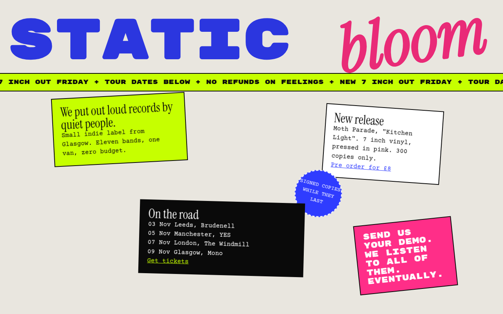

# Anti Design CSS Template (Free)



**Live demo:** https://mmrahmanbappi.github.io/100-css-designs/02-bold-raw/015-anti-design/demo.html
**Details and code:** https://mmrahmanbappi.github.io/100-css-designs/02-bold-raw/015-anti-design/

Free anti design website template for creative brands. Clashing fonts, rotated blocks, a moving ticker and rule breaking layout. Live demo and download.

## What is anti design?

Anti design breaks the rules on purpose. Fonts clash, blocks sit at odd angles, and nothing lines up the way a normal template would. It feels like a flyer taped to a wall.

It still needs care underneath. On phones the blocks fall back into a simple column, links stay easy to find, and the ticker stops for people who prefer less motion.

## What you get

- Three clashing fonts used together
- Blocks placed and rotated freely
- Scrolling ticker that stops with reduced motion
- Round rotated sticker badge
- Stacks into one clean column on phones

## The key CSS

```css
.blk { position: absolute; border: 2px solid #0a0a0a; padding: 18px 20px; }
.a { top: 10px; left: 4%; transform: rotate(-3deg); background: #c6ff00; }
.d { transform: rotate(-6deg); background: #ff2e88; }

@media (max-width: 820px) {
  .blk { position: static; width: auto; }
}
```

## How to use

1. Download `demo.html` from this folder.
2. Change the text, colors and links.
3. Upload it anywhere. One file, no build step.

## License

MIT. Free for personal and commercial use.
