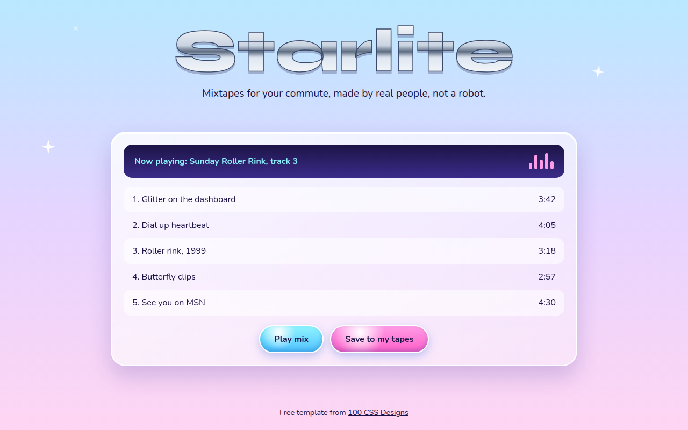

# Y2K Revival CSS Template (Free)



**Live demo:** https://mmrahmanbappi.github.io/100-css-designs/02-bold-raw/016-y2k-revival/demo.html
**Details and code:** https://mmrahmanbappi.github.io/100-css-designs/02-bold-raw/016-y2k-revival/

Free Y2K aesthetic website template with chrome text, bubble buttons, sparkles and early 2000s gradients in pure CSS. Live demo and HTML download.

## What is y2k revival?

Y2K style brings back the look of the early 2000s: shiny chrome letters, glossy bubble buttons, sparkles and soft sky gradients. It is fun, a little silly and very popular with younger audiences again.

Chrome text is made with a striped gradient clipped to the letters. The bubble buttons use a white radial gradient for the shine. The sparkles are CSS stars made with clip-path.

## What you get

- Chrome headline made with background-clip text
- Glossy bubble buttons in cyan and pink
- Twinkling star sparkles in pure CSS
- Music player card with track list
- Sparkles stop for reduced motion

## The key CSS

```css
.chrome {
  background: linear-gradient(180deg, #fff 0%, #c9d3e0 40%, #5c6b80 50%, #dfe7f1 60%, #fff 100%);
  -webkit-background-clip: text; background-clip: text;
  color: transparent;
  -webkit-text-stroke: 1.5px #3a4a6b;
}
.bubble {
  border-radius: 999px;
  background: radial-gradient(circle at 30% 25%, #fff 0, transparent 35%), linear-gradient(#8ff4ff, #4fc2ff);
}
```

## How to use

1. Download `demo.html` from this folder.
2. Change the text, colors and links.
3. Upload it anywhere. One file, no build step.

## License

MIT. Free for personal and commercial use.
