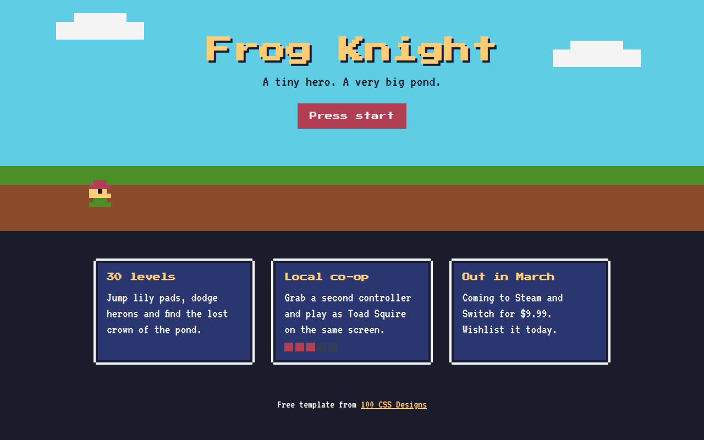

# Retro Pixel CSS Template (Free)



**Live demo:** https://mmrahmanbappi.github.io/100-css-designs/02-bold-raw/018-retro-pixel/demo.html
**Details and code:** https://mmrahmanbappi.github.io/100-css-designs/02-bold-raw/018-retro-pixel/

Free retro 8-bit website template for an indie game. Pixel fonts, pixel borders, a CSS pixel art hero and a blinking start button. Live demo and download.

## What is retro pixel?

Retro pixel style copies the look of 8-bit and 16-bit games. Chunky pixel fonts, square borders, flat blocky scenery and a little character that bounces in place.

The hero character is drawn with one tiny element and a long list of box shadows, one per pixel. The bounce uses steps() so it moves in hard jumps like an old console.

## What you get

- Press Start 2P and VT323 pixel fonts
- Pixel art frog made with box-shadow
- Blocky sky, grass and dirt scene
- Blinking start button
- Pixel health bar on a feature card

## The key CSS

```css
.hero {
  width: 8px; height: 8px;
  box-shadow: 16px 0 #b13e53, 24px 0 #b13e53, 8px 8px #b13e53 /* one shadow per pixel */;
  animation: hop 1.2s steps(2) infinite;
}
@keyframes hop { 50% { transform: translateY(-16px); } }

.start { font-family: "Press Start 2P", monospace; animation: blink 1s steps(1) infinite; }
```

## How to use

1. Download `demo.html` from this folder.
2. Change the text, colors and links.
3. Upload it anywhere. One file, no build step.

## License

MIT. Free for personal and commercial use.
