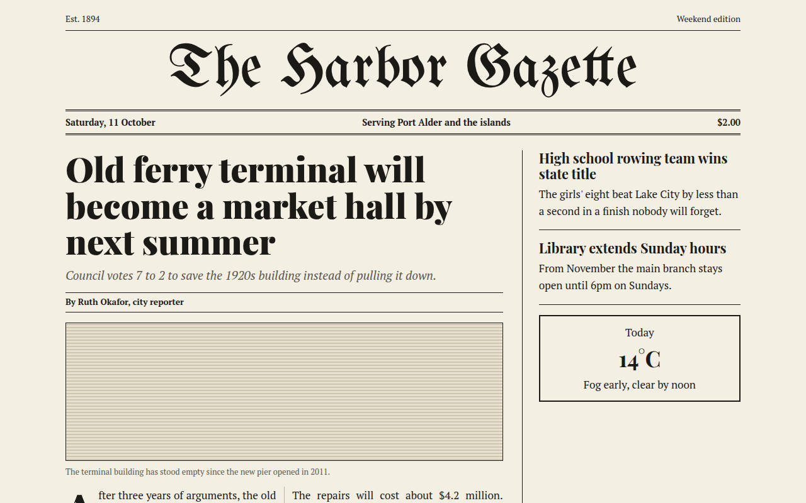

# Newspaper Editorial CSS Template (Free)



**Live demo:** https://mmrahmanbappi.github.io/100-css-designs/02-bold-raw/019-newspaper-editorial/demo.html
**Details and code:** https://mmrahmanbappi.github.io/100-css-designs/02-bold-raw/019-newspaper-editorial/

Free newspaper style website template with a masthead, serif headlines, drop cap and multi column text in pure CSS. Live demo and HTML download.

## What is newspaper editorial?

Newspaper editorial style brings the front page of a printed paper to the web. A blackletter masthead, a double rule under the date, big serif headlines and text flowing in narrow columns.

CSS columns do the heavy lifting. One property splits the story into two columns with a thin rule between them, and ::first-letter makes the classic drop cap.

## What you get

- Blackletter masthead font
- Double rule date bar
- Two column story with column rule
- Drop cap on the first paragraph
- Sidebar with short stories and weather box

## The key CSS

```css
.cols {
  columns: 2;
  column-gap: 26px;
  column-rule: 1px solid #b9b2a2;
  text-align: justify; hyphens: auto;
}
.cols p:first-child::first-letter {
  float: left; font-size: 4rem; line-height: .8;
  font-family: "Playfair Display", serif; font-weight: 900;
}
.date { border-block: 3px double #1b1a17; }
```

## How to use

1. Download `demo.html` from this folder.
2. Change the text, colors and links.
3. Upload it anywhere. One file, no build step.

## License

MIT. Free for personal and commercial use.
