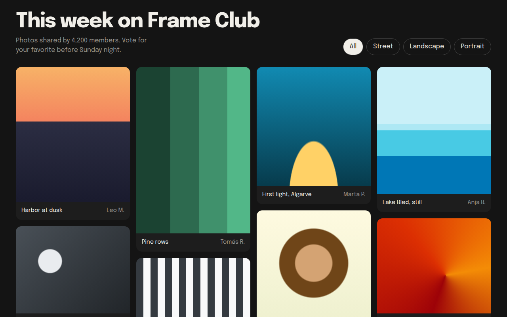

# Masonry CSS Template (Free)



**Live demo:** https://mmrahmanbappi.github.io/100-css-designs/03-layout-patterns/022-masonry/demo.html
**Details and code:** https://mmrahmanbappi.github.io/100-css-designs/03-layout-patterns/022-masonry/

Free masonry grid template in pure CSS for a photo gallery. Pinterest style staggered columns with no JavaScript library. Live demo and HTML download.

## What is masonry?

A masonry layout stacks items of different heights in columns, so there are no big gaps. It is the layout Pinterest made famous, and it suits photos better than a strict grid.

You do not need a JavaScript library. CSS columns do it: set a column width, and add break-inside: avoid so no card gets split between two columns.

## What you get

- Pure CSS masonry with the columns property
- Cards never split across columns
- Photo placeholders drawn with gradients
- Filter buttons with pressed state
- Dark gallery background that makes images pop

## The key CSS

```css
.wall {
  columns: 4 260px;
  column-gap: 16px;
}
figure {
  break-inside: avoid;
  margin: 0 0 16px;
  border-radius: 14px;
  overflow: hidden;
}
```

## How to use

1. Download `demo.html` from this folder.
2. Change the text, colors and links.
3. Upload it anywhere. One file, no build step.

## License

MIT. Free for personal and commercial use.
