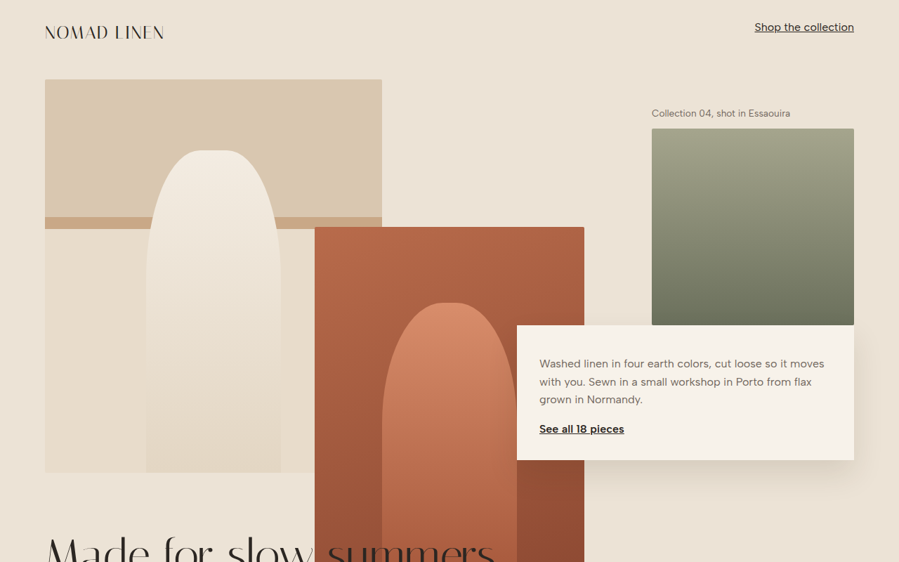

# Broken Grid CSS Template (Free)



**Live demo:** https://mmrahmanbappi.github.io/100-css-designs/03-layout-patterns/024-broken-grid/demo.html
**Details and code:** https://mmrahmanbappi.github.io/100-css-designs/03-layout-patterns/024-broken-grid/

Free broken grid website template for a fashion lookbook. Overlapping images and text placed on an asymmetric 12 column CSS Grid. Live demo and download.

## What is broken grid?

A broken grid still uses a grid, but lets things overlap and cross the lines. Images sit on top of each other, text boxes cut into photos, and the headline breaks out of its column.

It looks like an editorial fashion spread. CSS Grid makes it easy because items can share the same rows and columns, and z-index decides which one sits on top.

## What you get

- 12 column grid with overlapping items
- Layered image blocks with z-index
- Headline that crosses into the photos
- Floating text card with shadow
- Turns into a clean vertical list on phones

## The key CSS

```css
.look {
  display: grid;
  grid-template-columns: repeat(12, 1fr);
  grid-template-rows: repeat(10, 70px);
}
.i1  { grid-column: 1 / 6;  grid-row: 1 / 9; }
.i2  { grid-column: 5 / 9;  grid-row: 4 / 11; z-index: 1; }
.txt { grid-column: 8 / 13; grid-row: 6 / 10; z-index: 2; }
```

## How to use

1. Download `demo.html` from this folder.
2. Change the text, colors and links.
3. Upload it anywhere. One file, no build step.

## License

MIT. Free for personal and commercial use.
