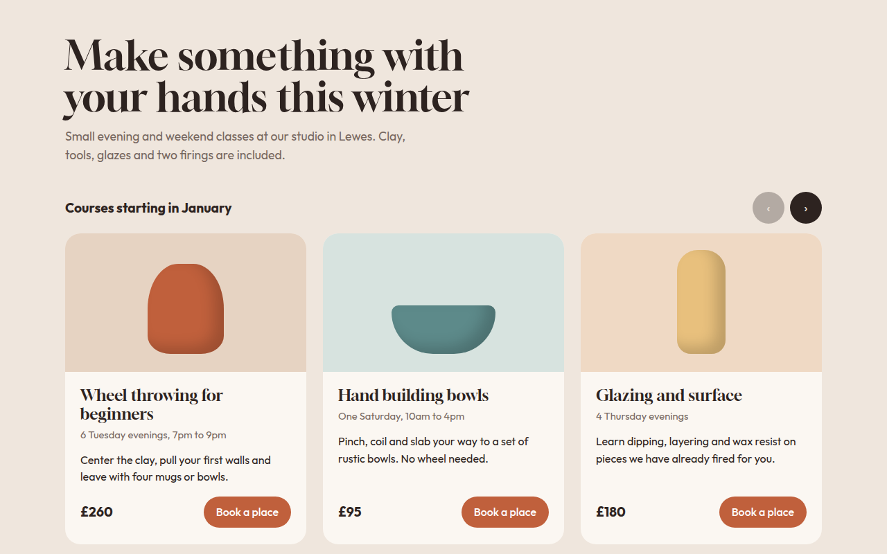

# Card Carousel CSS Template (Free)



**Live demo:** https://mmrahmanbappi.github.io/100-css-designs/03-layout-patterns/028-card-carousel/demo.html
**Details and code:** https://mmrahmanbappi.github.io/100-css-designs/03-layout-patterns/028-card-carousel/

Free card carousel template with CSS scroll snap, arrow buttons and dots. Swipeable course cards for a pottery studio. Live demo and HTML download.

## What is card carousel?

A card carousel shows a row of cards that people swipe or click through. It saves space when you have more items than fit on one screen, like classes, products or reviews.

This one is built on native scrolling with scroll snap, so swiping feels natural on phones. A small script adds the arrow buttons and the dots that show where you are.

## What you get

- Three cards on desktop, two on tablet, one and a bit on phone
- Native swipe with scroll snap
- Arrow buttons that disable at each end
- Dots that follow the scroll position
- Pots drawn in CSS with one custom property set

## The key CSS

```css
.rail {
  display: grid;
  grid-auto-flow: column;
  grid-auto-columns: calc((100% - 48px) / 3);
  gap: 24px;
  overflow-x: auto;
  scroll-snap-type: x mandatory;
}
.c { scroll-snap-align: start; }
@media (max-width: 560px) { .rail { grid-auto-columns: 85%; } }
```

## How to use

1. Download `demo.html` from this folder.
2. Change the text, colors and links.
3. Upload it anywhere. One file, no build step.

## License

MIT. Free for personal and commercial use.
