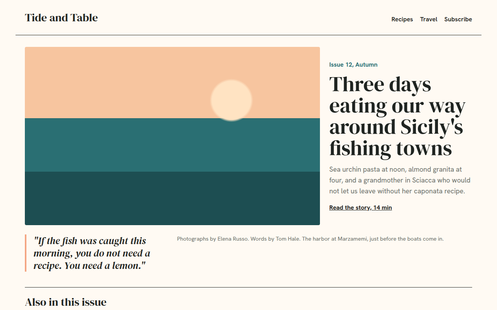

# Magazine Layout CSS Template (Free)



**Live demo:** https://mmrahmanbappi.github.io/100-css-designs/03-layout-patterns/029-magazine-layout/demo.html
**Details and code:** https://mmrahmanbappi.github.io/100-css-designs/03-layout-patterns/029-magazine-layout/

Free magazine website template with a cover story, CSS grid template areas, pull quote and article grid. Built for a food and travel magazine. Live demo and download.

## What is magazine layout?

A magazine layout looks like the opening spread of a printed magazine. A big cover photo, a headline beside it, a pull quote and a caption, then a row of smaller stories.

CSS grid-template-areas makes it easy to read and change. You name each area, draw the layout in the CSS like a small map, and redraw it for phones.

## What you get

- Cover story built with grid-template-areas
- Italic pull quote with accent bar
- Photo caption and credit line
- Also in this issue grid with one wide story
- Simple one column layout on phones

## The key CSS

```css
.cover {
  display: grid;
  grid-template-columns: repeat(6, 1fr);
  grid-template-areas:
    "img img img img txt txt"
    "img img img img txt txt"
    "q   q   cap cap cap cap";
  gap: 24px;
}
.img { grid-area: img; }  .txt { grid-area: txt; }
.q   { grid-area: q; }    .cap { grid-area: cap; }
```

## How to use

1. Download `demo.html` from this folder.
2. Change the text, colors and links.
3. Upload it anywhere. One file, no build step.

## License

MIT. Free for personal and commercial use.
