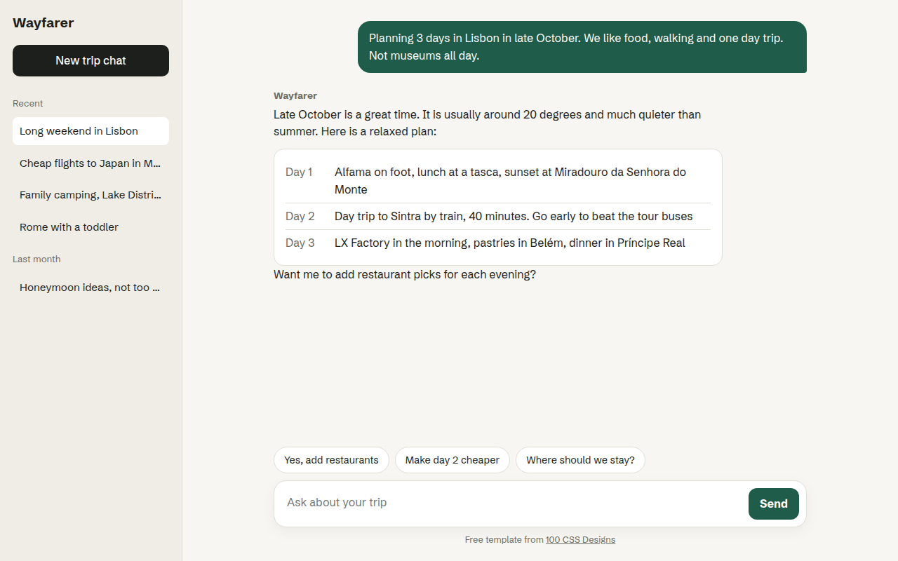

# Chat UI CSS Template (Free)



**Live demo:** https://mmrahmanbappi.github.io/100-css-designs/04-ai-era-interfaces/031-chat-ui/demo.html
**Details and code:** https://mmrahmanbappi.github.io/100-css-designs/04-ai-era-interfaces/031-chat-ui/

Free chat interface template for an AI assistant. Sidebar of past chats, message bubbles, suggestion chips and a working input box. Live demo.

## What is chat ui?

A chat first interface puts a conversation at the center of the product. It is the layout people now expect from AI tools: past chats on the left, messages in the middle and a big input at the bottom.

This template already works as a front end. You can type, press Enter, tap a suggestion chip, and a reply appears. Connect your own AI API where the demo reply is and it becomes a real assistant.

## What you get

- Sidebar with recent chats grouped by date
- User and assistant message styles
- Structured answer card inside a reply
- Suggestion chips that send a message
- Enter to send, Shift and Enter for a new line

## The key CSS

```css
.app { display: grid; grid-template-columns: 260px 1fr; height: 100vh; }
.chat { display: flex; flex-direction: column; height: 100vh; }
.log { flex: 1; overflow-y: auto; padding: 30px max(24px, calc((100% - 760px) / 2)); }
.msg.me {
  margin-left: auto; width: fit-content;
  background: #1f5c4a; color: #fff;
  border-radius: 18px 18px 4px 18px; padding: 12px 16px;
}
```

## How to use

1. Download `demo.html` from this folder.
2. Change the text, colors and links.
3. Upload it anywhere. One file, no build step.

## License

MIT. Free for personal and commercial use.
