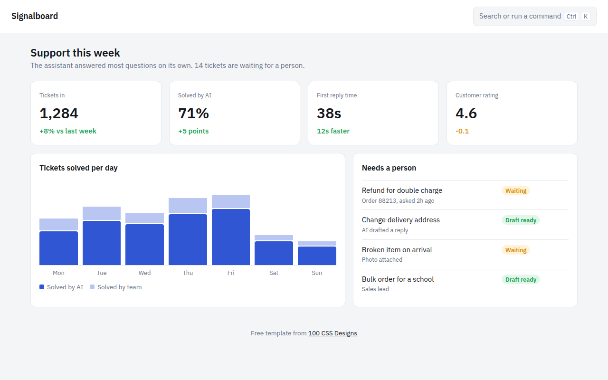

# AI Dashboard CSS Template (Free)



**Live demo:** https://mmrahmanbappi.github.io/100-css-designs/04-ai-era-interfaces/032-ai-dashboard/demo.html
**Details and code:** https://mmrahmanbappi.github.io/100-css-designs/04-ai-era-interfaces/032-ai-dashboard/

Free AI dashboard template for a support tool. KPI cards, CSS bar chart, ticket list and a working command palette opened with Ctrl K. Live demo and download.

## What is ai dashboard?

An AI dashboard shows what an AI system did and what still needs a human. Clear numbers at the top, a simple chart of the trend, and a short list of items waiting for a person.

Most modern apps also have a command palette. Press Ctrl K (or Cmd K on a Mac) and a search box opens where you can jump anywhere or run an action. It is built in here with a few lines of JavaScript.

## What you get

- Four KPI cards with change versus last week
- Stacked bar chart made only with CSS
- Needs a person list with status pills
- Command palette on Ctrl K or Cmd K, closes with Escape
- Filter as you type inside the palette

## The key CSS

```css
.pal {
  position: fixed; inset: 0;
  background: rgba(16, 24, 40, .35);
  display: none; align-items: start; justify-content: center;
  padding-top: 14vh;
}
.pal.open { display: flex; }
.bars { display: flex; align-items: end; gap: 10px; height: 180px; }
.bars i.ai { background: #3056d3; border-radius: 4px 4px 0 0; }
```

## How to use

1. Download `demo.html` from this folder.
2. Change the text, colors and links.
3. Upload it anywhere. One file, no build step.

## License

MIT. Free for personal and commercial use.
