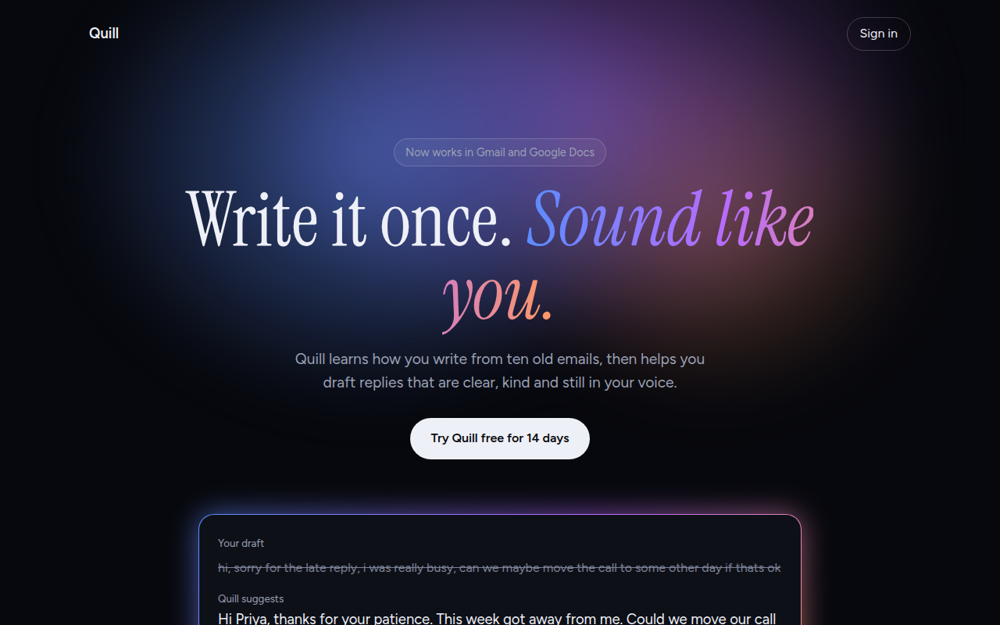

# AI Glow Gradient CSS Template (Free)



**Live demo:** https://mmrahmanbappi.github.io/100-css-designs/04-ai-era-interfaces/033-ai-glow-gradient/demo.html
**Details and code:** https://mmrahmanbappi.github.io/100-css-designs/04-ai-era-interfaces/033-ai-glow-gradient/

Free AI style landing page template with a soft glowing mesh gradient, gradient text and a glowing border card on a dark theme. Live demo and HTML download.

## What is ai glow gradient?

The AI glow look is everywhere on new AI products: a dark page with a soft cloud of blue, violet and orange light behind the headline, and cards with a glowing gradient edge.

The glow is three radial gradients blurred together. The glowing border is a gradient behind the card with 1px of padding, plus a blurred copy of it underneath. No images are used.

## What you get

- Blurred mesh glow made from three radial gradients
- Gradient text on the key phrase
- Card with a glowing gradient border
- Before and after writing example
- Dark theme with soft gray body text

## The key CSS

```css
.glow {
  position: absolute; left: 50%; top: -180px;
  width: 1100px; height: 700px; transform: translateX(-50%);
  background:
    radial-gradient(closest-side at 35% 55%, rgba(91,140,255,.55), transparent),
    radial-gradient(closest-side at 60% 45%, rgba(184,107,255,.5), transparent),
    radial-gradient(closest-side at 75% 65%, rgba(255,154,98,.35), transparent);
  filter: blur(40px);
}
.gb { padding: 1px; border-radius: 20px; background: linear-gradient(135deg, #5b8cff, #b86bff, #ff9a62); }
```

## How to use

1. Download `demo.html` from this folder.
2. Change the text, colors and links.
3. Upload it anywhere. One file, no build step.

## License

MIT. Free for personal and commercial use.
