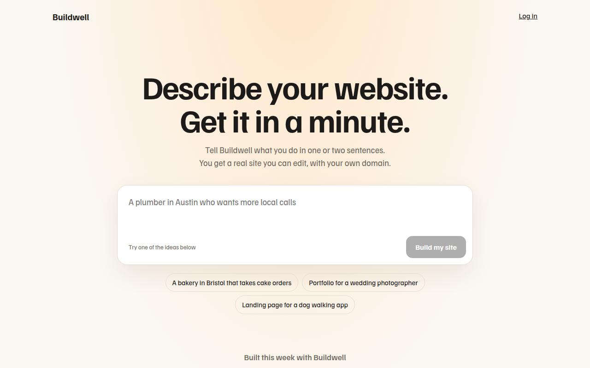

# Prompt Box Hero CSS Template (Free)



**Live demo:** https://mmrahmanbappi.github.io/100-css-designs/04-ai-era-interfaces/034-prompt-box-hero/demo.html
**Details and code:** https://mmrahmanbappi.github.io/100-css-designs/04-ai-era-interfaces/034-prompt-box-hero/

Free prompt box hero template where a big input is the main hero. Rotating example prompts, suggestion chips and a word count. Live demo and HTML download.

## What is prompt box hero?

A prompt box hero replaces the usual big picture with the product itself: a large text box that invites you to type. Lovable, v0 and many AI builders open this way, because trying it is the best pitch.

The placeholder changes every few seconds to show ideas, the chips fill the box in one tap, and the main button only turns on once there is something to send.

## What you get

- Large prompt box with a focus glow
- Placeholder that rotates through example ideas
- Suggestion chips that fill the box
- Button disabled until there is text
- Built this week gallery below

## The key CSS

```css
.pb {
  background: #fff;
  border: 1px solid #e3ddd2;
  border-radius: 22px;
  padding: 14px;
}
.pb:focus-within {
  border-color: #2a6df4;
  box-shadow: 0 0 0 4px rgba(42, 109, 244, .15);
}
textarea { width: 100%; border: 0; resize: none; min-height: 90px; font-size: 1.15rem; }
```

## How to use

1. Download `demo.html` from this folder.
2. Change the text, colors and links.
3. Upload it anywhere. One file, no build step.

## License

MIT. Free for personal and commercial use.
