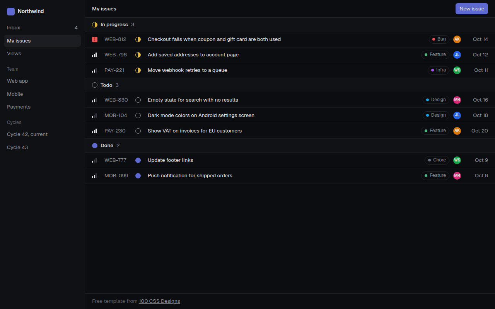

# Linear Style Minimal CSS Template (Free)



**Live demo:** https://mmrahmanbappi.github.io/100-css-designs/04-ai-era-interfaces/038-linear-style/demo.html
**Details and code:** https://mmrahmanbappi.github.io/100-css-designs/04-ai-era-interfaces/038-linear-style/

Free Linear style app template for an issue tracker. Dark, sharp and data dense list with status icons, priority bars and labels. Live demo and HTML download.

## What is linear style minimal?

The Linear style comes from the Linear issue tracker, and many SaaS products now copy it. Dark background, small sharp text, thin lines and a lot of information in very little space.

It works because nothing is wasted. Status, priority, labels and people are shown with tiny icons drawn in CSS, so each row stays one line tall and easy to scan.

## What you get

- Dark sidebar with workspace, teams and cycles
- Grouped list: in progress, todo and done
- Priority bars and urgent badge in CSS
- Status circles, including a half filled in progress icon
- Colored labels and avatar initials

## The key CSS

```css
.row {
  display: grid;
  grid-template-columns: 22px 70px 22px 1fr auto 24px 56px;
  gap: 10px; align-items: center;
  height: 40px; padding: 0 18px;
  border-bottom: 1px solid #18191e;
}
.st.prog { border: 1.5px solid #e2b93b;
  background: conic-gradient(#e2b93b 0 50%, transparent 50%); border-radius: 50%; }
```

## How to use

1. Download `demo.html` from this folder.
2. Change the text, colors and links.
3. Upload it anywhere. One file, no build step.

## License

MIT. Free for personal and commercial use.
