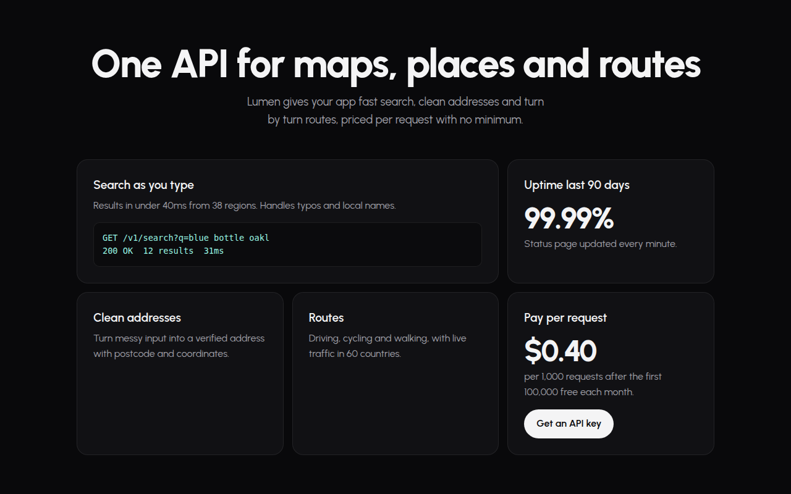

# Spotlight Cards CSS Template (Free)



**Live demo:** https://mmrahmanbappi.github.io/100-css-designs/04-ai-era-interfaces/039-spotlight-cards/demo.html
**Details and code:** https://mmrahmanbappi.github.io/100-css-designs/04-ai-era-interfaces/039-spotlight-cards/

Free spotlight card template where cards and their borders glow wherever your cursor is. Dark feature grid made with CSS radial gradients. Live demo and download.

## What is spotlight cards?

Spotlight cards light up where your cursor is, like shining a torch over a dark surface. The glow spreads across the card and along its border, and moves with the mouse.

A tiny script sends the cursor position to each card as two CSS variables. CSS does the rest with radial gradients, and a mask trick turns one of them into a glowing border.

## What you get

- Soft glow that follows the cursor
- Glowing border using mask composite
- All cards react together as one surface
- Bento style grid with one wide card
- Glow always on for touch screens

## The key CSS

```css
.sp::before {
  content: ""; position: absolute; inset: 0; border-radius: inherit;
  background: radial-gradient(400px circle at var(--x) var(--y), rgba(94,234,212,.12), transparent 40%);
}
.sp::after {
  content: ""; position: absolute; inset: 0; border-radius: inherit; padding: 1px;
  background: radial-gradient(300px circle at var(--x) var(--y), rgba(94,234,212,.7), transparent 40%);
  -webkit-mask: linear-gradient(#000 0 0) content-box, linear-gradient(#000 0 0);
  -webkit-mask-composite: xor; mask-composite: exclude;
}
```

## How to use

1. Download `demo.html` from this folder.
2. Change the text, colors and links.
3. Upload it anywhere. One file, no build step.

## License

MIT. Free for personal and commercial use.
