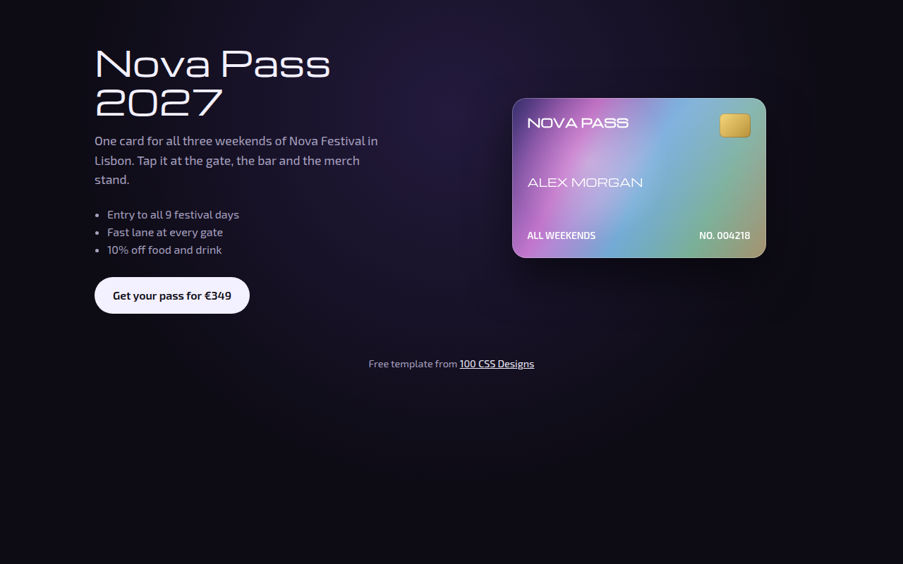

# Holographic CSS Template (Free)



**Live demo:** https://mmrahmanbappi.github.io/100-css-designs/04-ai-era-interfaces/040-holographic/demo.html
**Details and code:** https://mmrahmanbappi.github.io/100-css-designs/04-ai-era-interfaces/040-holographic/

Free holographic card template with an iridescent rainbow shine that shifts as the card tilts under your cursor. Built for a festival pass. Live demo and download.

## What is holographic?

Holographic style copies the rainbow foil on trading cards and ID cards. As you tilt the card, the colors slide across it and a bright shine moves with your view.

The card tilts in 3D with CSS transforms. The rainbow is a wide gradient blended on top, and moving the mouse shifts its position, so the colors really seem to change with the angle.

## What you get

- 3D tilt that follows the cursor
- Rainbow foil layer that slides as you move
- Moving light spot on the surface
- CSS drawn gold chip
- Card resets smoothly when the cursor leaves

## The key CSS

```css
.card {
  transform: rotateX(var(--rx)) rotateY(var(--ry));
  transition: transform .15s ease-out;
}
.card::before {
  content: ""; position: absolute; inset: 0;
  mix-blend-mode: screen; opacity: .6;
  background: linear-gradient(115deg, transparent 20%, #ff4fb4 30%, #3fe0ff 40%,
    #7dff6a 50%, #ffd23f 60%, #9b6bff 70%, transparent 80%);
  background-size: 250% 250%;
  background-position: var(--mx) var(--my);
}
```

## How to use

1. Download `demo.html` from this folder.
2. Change the text, colors and links.
3. Upload it anywhere. One file, no build step.

## License

MIT. Free for personal and commercial use.
