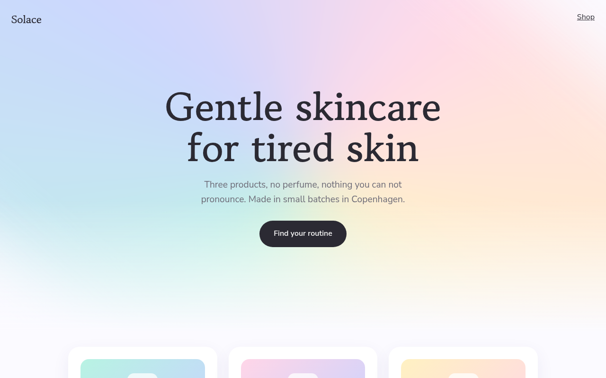

# Aurora Gradient CSS Template (Free)



**Live demo:** https://mmrahmanbappi.github.io/100-css-designs/05-color-light/041-aurora-gradient/demo.html
**Details and code:** https://mmrahmanbappi.github.io/100-css-designs/05-color-light/041-aurora-gradient/

Free aurora gradient website template for a skincare brand. Soft flowing pastel colors on a light background, animated with one CSS conic gradient. Live demo and download.

## What is aurora gradient?

An aurora gradient is a soft, slowly moving wash of color, like the northern lights seen through fog. On a light background it feels fresh and calm, which suits beauty, wellness and lifestyle brands.

The whole effect is one conic gradient, blurred heavily and rotated very slowly. A fade at the bottom blends it into the page, so the products below sit on clean white.

## What you get

- One blurred conic gradient that turns every 30 seconds
- Fade into white so content stays clear
- Rounded product cards with matching gradients
- Gowun Batang serif for a gentle feel
- Animation stops for reduced motion

## The key CSS

```css
.aur::before {
  content: ""; position: absolute; inset: -30%;
  background: conic-gradient(from 180deg, #b8f3e3, #c7d2ff, #ffd6e8, #fff1c2, #b8f3e3);
  filter: blur(70px);
  animation: spin 30s linear infinite;
}
@keyframes spin { to { transform: rotate(360deg); } }
.aur::after { content: ""; position: absolute; inset: 0;
  background: linear-gradient(180deg, transparent 60%, #fbfaff); }
```

## How to use

1. Download `demo.html` from this folder.
2. Change the text, colors and links.
3. Upload it anywhere. One file, no build step.

## License

MIT. Free for personal and commercial use.
