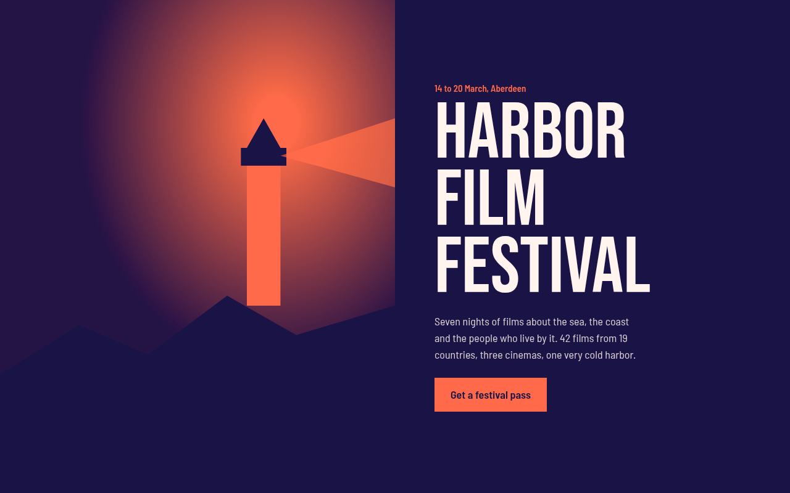

# Duotone CSS Template (Free)



**Live demo:** https://mmrahmanbappi.github.io/100-css-designs/05-color-light/042-duotone/demo.html
**Details and code:** https://mmrahmanbappi.github.io/100-css-designs/05-color-light/042-duotone/

Free duotone website template for a film festival. Any image becomes two colors with CSS blend modes, in a bold poster layout. Live demo, key CSS and download.

## What is duotone?

Duotone turns an image into just two colors, one for the shadows and one for the highlights. Spotify made it famous, and it is still one of the fastest ways to make mixed photos look like one brand.

The trick uses two blend modes. The image is made grayscale and multiplied over the light color, then a layer of the dark color is placed on top with lighten. Change two CSS variables and you get a new palette.

## What you get

- Duotone effect on any image or SVG with pure CSS
- Palette set by two CSS variables per image
- Big Bebas Neue poster headline
- Split hero with a lighthouse scene
- Three featured films, each in its own palette

## The key CSS

```css
.duo { position: relative; background: var(--light); }
.duo .src { filter: grayscale(1) contrast(1.2); mix-blend-mode: multiply; }
.duo::after {
  content: ""; position: absolute; inset: 0;
  background: var(--dark);
  mix-blend-mode: lighten;
}
```

## How to use

1. Download `demo.html` from this folder.
2. Change the text, colors and links.
3. Upload it anywhere. One file, no build step.

## License

MIT. Free for personal and commercial use.
