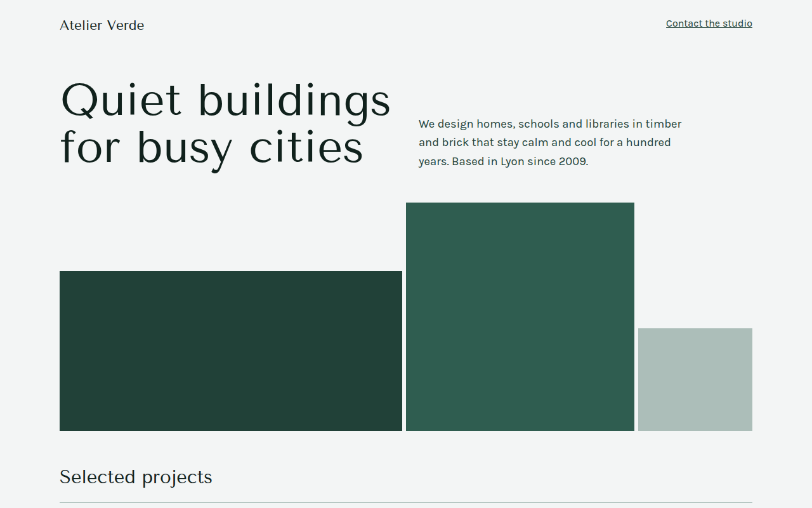

# Monochrome CSS Template (Free)



**Live demo:** https://mmrahmanbappi.github.io/100-css-designs/05-color-light/043-monochrome/demo.html
**Details and code:** https://mmrahmanbappi.github.io/100-css-designs/05-color-light/043-monochrome/

Free monochrome website template for an architecture studio. Every color is a shade of one green, made with CSS color-mix from a single variable. Live demo.

## What is monochrome?

A monochrome design uses one color in many shades, from nearly white to nearly black. It feels calm and confident, and it is very hard to get wrong because every color already matches.

Here the whole palette comes from a single variable. CSS color-mix blends it with white for the light shades and with black for the dark ones, so changing one hex code recolors the whole site.

## What you get

- Five shades made from one color with color-mix
- Abstract building shapes in three tones
- Project list with year, type and status
- Swatch row showing the full palette
- Tenor Sans headings for a quiet, elegant look

## The key CSS

```css
:root {
  --h: #2f5d50;
  --s50:  color-mix(in srgb, var(--h) 6%,  #fff);
  --s100: color-mix(in srgb, var(--h) 14%, #fff);
  --s300: color-mix(in srgb, var(--h) 40%, #fff);
  --s500: var(--h);
  --s700: color-mix(in srgb, var(--h) 70%, #000);
  --s900: color-mix(in srgb, var(--h) 35%, #000);
}
```

## How to use

1. Download `demo.html` from this folder.
2. Change the text, colors and links.
3. Upload it anywhere. One file, no build step.

## License

MIT. Free for personal and commercial use.
