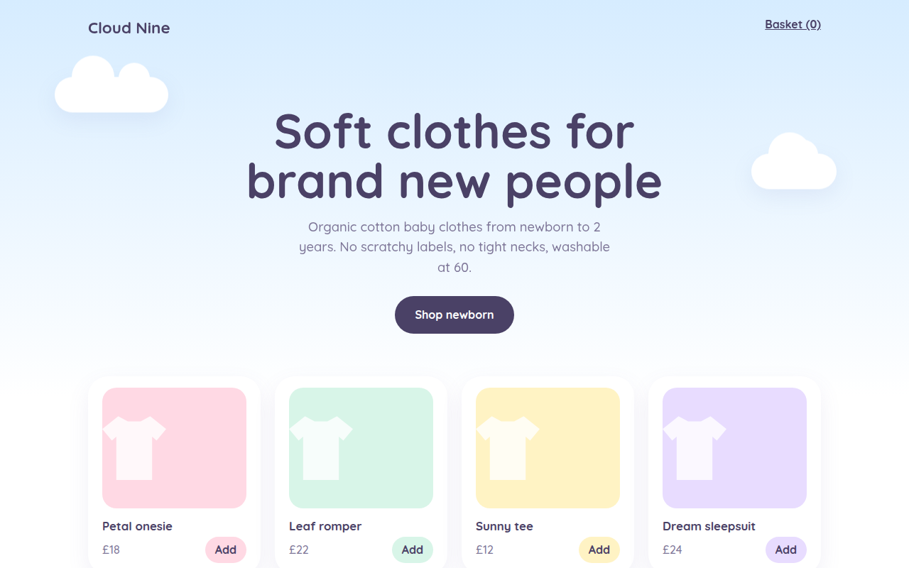

# Pastel Dream CSS Template (Free)



**Live demo:** https://mmrahmanbappi.github.io/100-css-designs/05-color-light/047-pastel-dream/demo.html
**Details and code:** https://mmrahmanbappi.github.io/100-css-designs/05-color-light/047-pastel-dream/

Free pastel website template for a baby clothing shop. Soft candy colors, CSS clouds, rounded product cards and add buttons. Live demo, key CSS and HTML download.

## What is pastel dream?

Pastel design uses soft, light colors like baby pink, sky blue, mint, lemon and lilac. It feels gentle and happy, and works well for products for children, weddings and anything sweet.

The trick is to keep text a deep muted purple instead of black, so contrast stays good without breaking the soft mood. The floating clouds are one element each, with two round pseudo elements on top.

## What you get

- Five color pastel palette
- Floating CSS clouds with soft shadows
- Product cards that pick up their own pastel color
- T-shirt shapes made with clip-path
- Deep purple text for good contrast

## The key CSS

```css
:root { --pink: #ffd9e4; --blue: #d6ecff; --mint: #d8f5e8; --lemon: #fff3c4; --lilac: #e8dcff; --ink: #4a4166; }

.cloud { background: #fff; border-radius: 60px; height: 50px; }
.cloud::before, .cloud::after { content: ""; position: absolute; background: #fff; border-radius: 50%; }
.cloud::before { width: 60px; height: 60px; top: -30px; left: 24px; }
```

## How to use

1. Download `demo.html` from this folder.
2. Change the text, colors and links.
3. Upload it anywhere. One file, no build step.

## License

MIT. Free for personal and commercial use.
