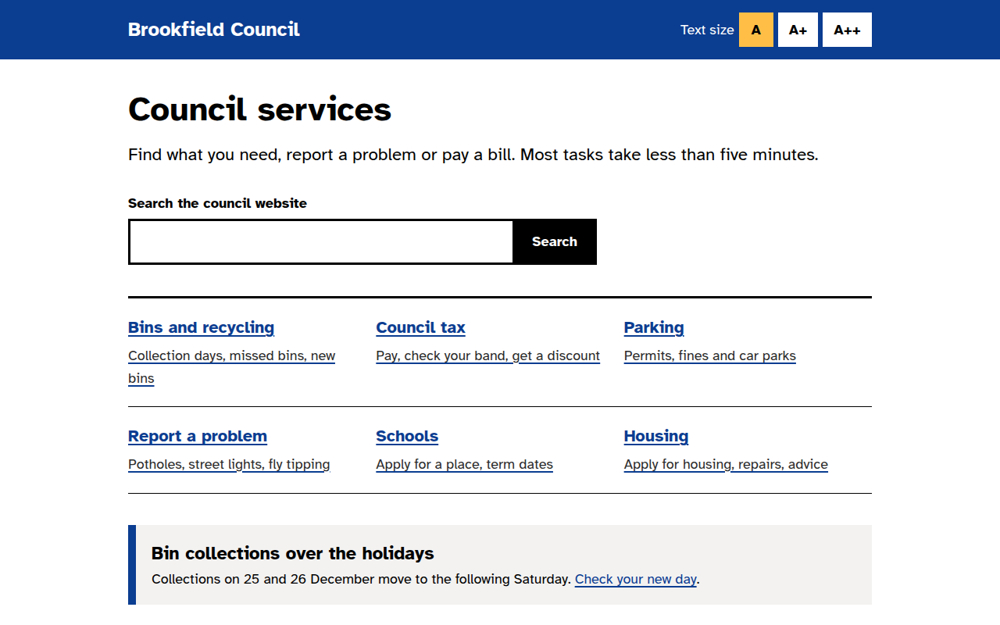

# High Contrast Accessible CSS Template (Free)



**Live demo:** https://mmrahmanbappi.github.io/100-css-designs/05-color-light/048-high-contrast/demo.html
**Details and code:** https://mmrahmanbappi.github.io/100-css-designs/05-color-light/048-high-contrast/

Free high contrast accessible website template for a local council. WCAG AAA colors, big focus rings, skip link and text size buttons. Live demo.

## What is high contrast accessible?

A high contrast accessible design puts everyone first: people with low vision, older users, people on bright screens outside, and keyboard users. Black on white, blue underlined links, large text and focus rings you cannot miss.

It follows the same ideas as the UK government design system. There is a skip link, every button is at least 44 pixels tall, and the text size buttons change one variable that scales the whole page.

## What you get

- Black and white text with contrast above 15 to 1
- Yellow and black focus ring on every control
- Skip to main content link
- Three text size buttons that scale the page
- Atkinson Hyperlegible, a font made for low vision readers

## The key CSS

```css
:root { font-size: var(--fs, 18px); }
:focus-visible {
  outline: 4px solid #000;
  box-shadow: 0 0 0 8px #ffbf47;
}
.skip { position: absolute; left: -9999px; }
.skip:focus { left: 12px; top: 12px; }
a { color: #0b3d91; text-decoration-thickness: 2px; text-underline-offset: 3px; }
```

## How to use

1. Download `demo.html` from this folder.
2. Change the text, colors and links.
3. Upload it anywhere. One file, no build step.

## License

MIT. Free for personal and commercial use.
