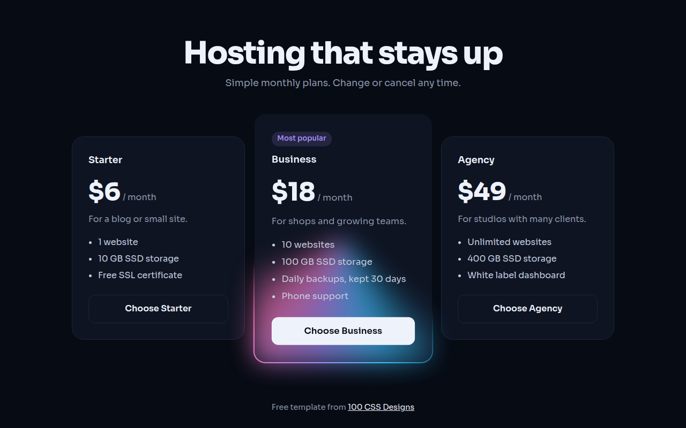

# Glow Borders CSS Template (Free)



**Live demo:** https://mmrahmanbappi.github.io/100-css-designs/05-color-light/050-glow-borders/demo.html
**Details and code:** https://mmrahmanbappi.github.io/100-css-designs/05-color-light/050-glow-borders/

Free animated glow border template for a pricing page. Light runs around the featured plan with a conic gradient and CSS @property. Live demo.

## What is glow borders?

A glow border draws a line of light that keeps running around the edge of a card. On a pricing page it points straight at the plan you want people to pick.

The border is a conic gradient in the border box, behind a solid card background in the padding box. CSS @property makes the gradient angle animatable, so the light spins with no JavaScript.

## What you get

- Light that runs around the featured card
- Soft blurred glow under the border
- Animated with @property, no JavaScript
- Three plan pricing layout
- Stops at a nice angle for reduced motion

## The key CSS

```css
@property --a { syntax: "<angle>"; initial-value: 0deg; inherits: false; }

.glow {
  border: 2px solid transparent;
  background:
    linear-gradient(#0e1422, #0e1422) padding-box,
    conic-gradient(from var(--a), transparent 0 60%, #38bdf8, #a78bfa, #f472b6, transparent 95%) border-box;
  animation: rot 4s linear infinite;
}
@keyframes rot { to { --a: 360deg; } }
```

## How to use

1. Download `demo.html` from this folder.
2. Change the text, colors and links.
3. Upload it anywhere. One file, no build step.

## License

MIT. Free for personal and commercial use.
