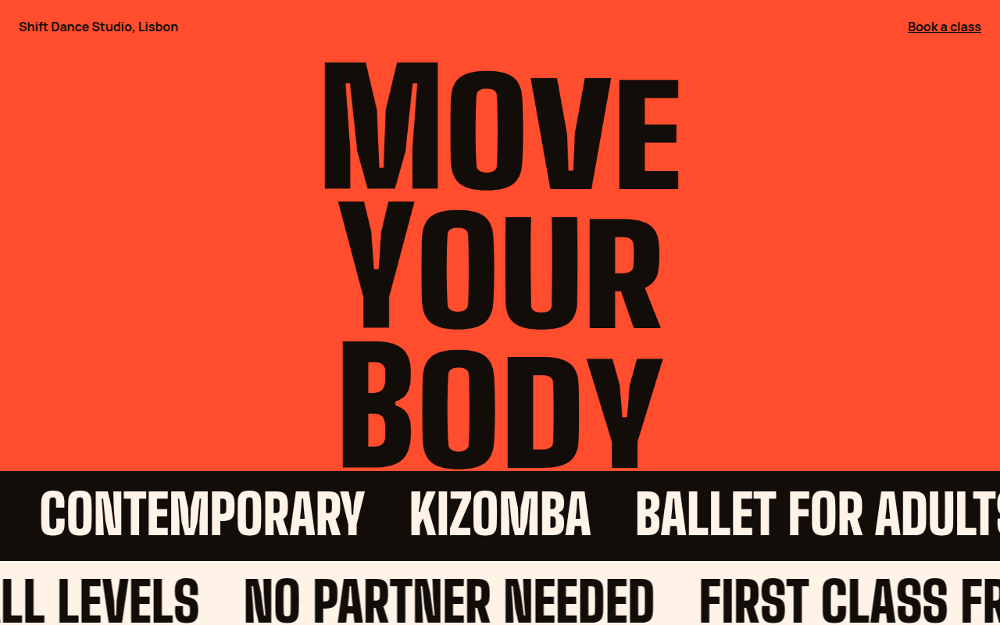

# Kinetic Type CSS Template (Free)



**Live demo:** https://mmrahmanbappi.github.io/100-css-designs/06-typography/051-kinetic-type/demo.html
**Details and code:** https://mmrahmanbappi.github.io/100-css-designs/06-typography/051-kinetic-type/

Free kinetic typography website template for a dance studio. Letters that stretch and bounce one after another, plus sliding text rows. Pure CSS, live demo and download.

## What is kinetic type?

Kinetic typography means text that moves. Letters stretch, squash and bounce, and whole lines slide across the screen. It turns the words themselves into the main visual, which suits brands about movement, music and energy.

Each letter is its own span with a small delay set by a CSS variable, so the bounce travels along the word like a wave. The sliding rows are a doubled line of text moved with translateX, so they loop without a gap.

## What you get

- Letters that stretch and bounce in a wave
- Delay per letter set with one CSS variable
- Two text rows sliding in opposite directions
- Screen readers read each word once
- All motion stops for reduced motion

## The key CSS

```css
.word span {
  display: inline-block;
  transform-origin: bottom;
  animation: hop 2.4s cubic-bezier(.6, 0, .3, 1) infinite;
  animation-delay: calc(var(--i) * .08s);
}
@keyframes hop {
  0%, 60%, 100% { transform: scaleY(1); }
  20% { transform: scaleY(1.35) translateY(-4%); }
  35% { transform: scaleY(.8); }
}
```

## How to use

1. Download `demo.html` from this folder.
2. Change the text, colors and links.
3. Upload it anywhere. One file, no build step.

## License

MIT. Free for personal and commercial use.
