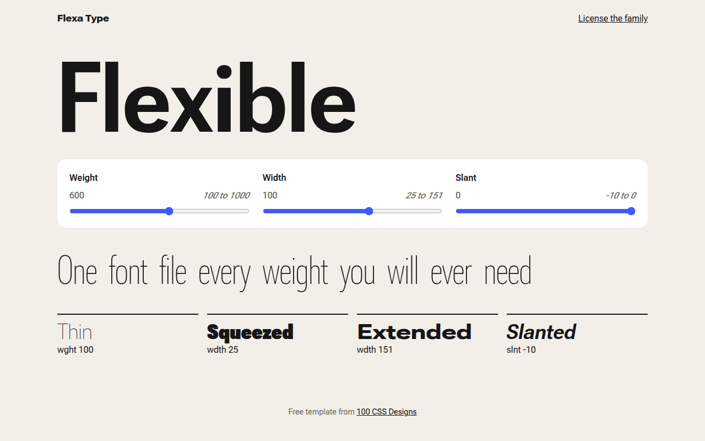

# Variable Fonts CSS Template (Free)



**Live demo:** https://mmrahmanbappi.github.io/100-css-designs/06-typography/052-variable-fonts/demo.html
**Details and code:** https://mmrahmanbappi.github.io/100-css-designs/06-typography/052-variable-fonts/

Free variable font template with live sliders for weight, width and slant, plus words that change weight on hover. Built as a type specimen. Live demo.

## What is variable fonts?

A variable font is one font file that holds every weight and width in between. Instead of loading Light, Regular and Bold separately, you pick any value you like, such as weight 640, and even animate between them.

This template uses Roboto Flex from Google Fonts. The sliders write their values into CSS variables, and font-variation-settings reads them. Hover a word in the sentence to watch it grow from thin to heavy.

## What you get

- Weight, width and slant sliders that update live
- Editable specimen text, click and type
- Words that change weight and width on hover
- Four axis examples at the bottom
- One font file for every style on the page

## The key CSS

```css
:root { --w: 600; --wd: 100; --sl: 0; }

.big {
  font-family: "Roboto Flex", sans-serif;
  font-variation-settings: "wght" var(--w), "wdth" var(--wd), "slnt" var(--sl);
  transition: font-variation-settings .15s;
}
.hov span { font-variation-settings: "wght" 200, "wdth" 60; transition: font-variation-settings .35s; }
.hov span:hover { font-variation-settings: "wght" 1000, "wdth" 151; }
```

## How to use

1. Download `demo.html` from this folder.
2. Change the text, colors and links.
3. Upload it anywhere. One file, no build step.

## License

MIT. Free for personal and commercial use.
