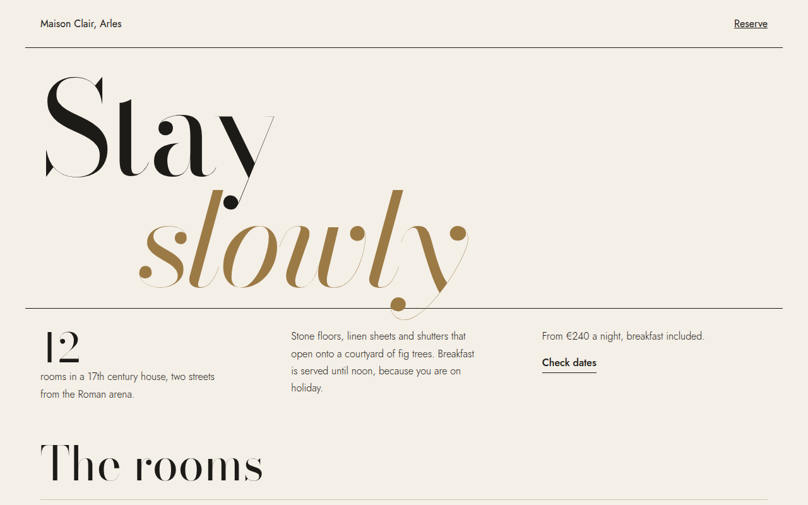

# Oversized Serif CSS Template (Free)



**Live demo:** https://mmrahmanbappi.github.io/100-css-designs/06-typography/053-oversized-serif/demo.html
**Details and code:** https://mmrahmanbappi.github.io/100-css-designs/06-typography/053-oversized-serif/

Free oversized serif website template for a boutique hotel. Huge high contrast Bodoni headlines, fine rules and generous white space. Live demo.

## What is oversized serif?

Oversized serif design uses one giant, elegant serif headline as the hero. The thin and thick strokes of a font like Bodoni look beautiful when they are huge, and the size alone says premium.

Everything around it stays quiet: a light sans serif for the text, thin black rules, and plenty of empty space. The indented italic line adds movement without any images.

## What you get

- Bodoni Moda headline up to 15rem
- Indented italic second line in gold
- Jost light for calm body text
- Thin rules to divide sections
- Room list with name, details and price

## The key CSS

```css
h1 {
  font-family: "Bodoni Moda", serif;
  font-weight: 400;
  font-size: clamp(4.4rem, 16vw, 15rem);
  line-height: .86;
  letter-spacing: -.03em;
}
h1 em { display: block; padding-left: 12vw; color: #9c7a45; }
```

## How to use

1. Download `demo.html` from this folder.
2. Change the text, colors and links.
3. Upload it anywhere. One file, no build step.

## License

MIT. Free for personal and commercial use.
