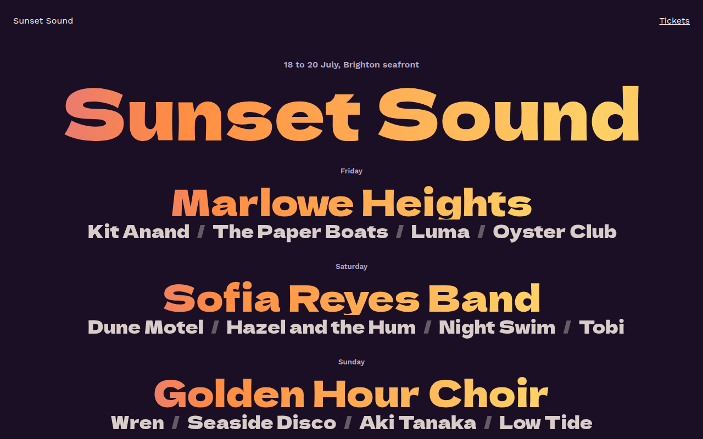

# Gradient Text CSS Template (Free)



**Live demo:** https://mmrahmanbappi.github.io/100-css-designs/06-typography/057-gradient-text/demo.html
**Details and code:** https://mmrahmanbappi.github.io/100-css-designs/06-typography/057-gradient-text/

Free gradient text website template for a festival lineup. Artist names in warm sunset gradients that slowly shift, made with background-clip text. Live demo and download.

## What is gradient text?

Gradient text fills words with a blend of colors instead of one flat color. Animate the gradient and the colors slowly flow through the letters, like a sunset moving across the sky.

The gradient is three times wider than the text, and an animation moves its position. That keeps it smooth and cheap for the browser, with no JavaScript.

## What you get

- Warm sunset gradient on every headliner
- Slow flowing color animation
- Lineup layout by day with support acts
- Dela Gothic One for bold festival type
- Animation stops for reduced motion

## The key CSS

```css
.gt {
  background: linear-gradient(90deg, #ffd166, #ff8c42, #ff3c7a, #b14aed, #ff8c42, #ffd166);
  background-size: 300% 100%;
  -webkit-background-clip: text;
  background-clip: text;
  color: transparent;
  animation: shift 10s linear infinite;
}
@keyframes shift { to { background-position: 300% 0; } }
```

## How to use

1. Download `demo.html` from this folder.
2. Change the text, colors and links.
3. Upload it anywhere. One file, no build step.

## License

MIT. Free for personal and commercial use.
