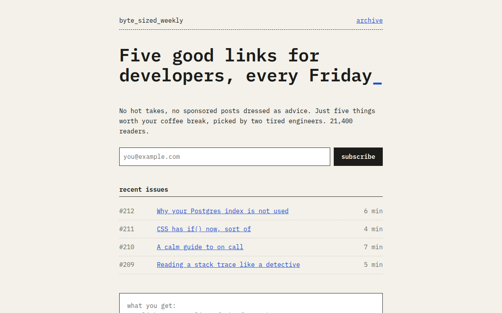

# Monospace CSS Template (Free)



**Live demo:** https://mmrahmanbappi.github.io/100-css-designs/06-typography/059-monospace/demo.html
**Details and code:** https://mmrahmanbappi.github.io/100-css-designs/06-typography/059-monospace/

Free monospace website template for a developer newsletter. One mono font on a character grid, a light paper look, aligned columns and a sign up form. Live demo and download.

## What is monospace?

A monospace site uses one font where every letter is the same width, like an old typewriter or a code editor. It looks honest and technical, and it makes text line up in neat columns.

The layout is measured in ch units, the width of one character. The page is 74 characters wide, gaps are two characters, and the issue list columns line up because every letter takes the same space.

## What you get

- IBM Plex Mono for every word on the page
- Spacing and widths set in ch units
- Blinking underscore after the headline
- Working sign up form with a confirmation
- Aligned issue list with numbers and reading time

## The key CSS

```css
body { font-family: "IBM Plex Mono", monospace; }
.wrap { max-width: 74ch; margin: 0 auto; padding: 40px 2ch; }
.issue {
  display: grid;
  grid-template-columns: 8ch 1fr 6ch;
  gap: 2ch;
}
h1::after { content: "_"; animation: b 1s steps(1) infinite; }
```

## How to use

1. Download `demo.html` from this folder.
2. Change the text, colors and links.
3. Upload it anywhere. One file, no build step.

## License

MIT. Free for personal and commercial use.
