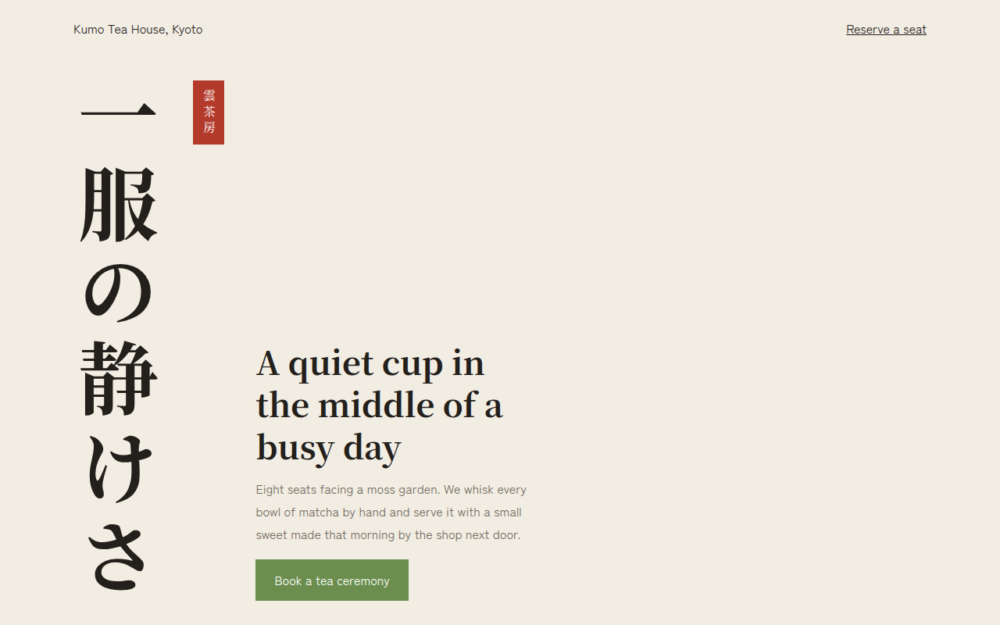

# Vertical Text CSS Template (Free)



**Live demo:** https://mmrahmanbappi.github.io/100-css-designs/06-typography/060-vertical-text/demo.html
**Details and code:** https://mmrahmanbappi.github.io/100-css-designs/06-typography/060-vertical-text/

Free vertical text website template for a Japanese tea house. Top to bottom writing with CSS writing-mode, vertical labels and a red stamp. Live demo.

## What is vertical text?

Vertical text runs from top to bottom instead of left to right. In Japanese and Chinese it is a traditional way to write, and on the web it adds a calm, poster like feel to a layout.

CSS writing-mode: vertical-rl turns any element vertical. Japanese characters stand upright on their own, and English stays readable too. It is real text, so it can be selected, translated and searched.

## What you get

- Large vertical Japanese headline with writing-mode
- Red vertical stamp like a seal
- Menu with vertical labels beside each item
- Correct lang="ja" on Japanese text
- Noto Serif JP and Zen Kaku Gothic New fonts

## The key CSS

```css
.v {
  writing-mode: vertical-rl;
  text-orientation: mixed;
}
.jp {
  font-family: "Noto Serif JP", serif;
  font-size: clamp(3.4rem, 8vw, 6.4rem);
  letter-spacing: .1em;
}
```

## How to use

1. Download `demo.html` from this folder.
2. Change the text, colors and links.
3. Upload it anywhere. One file, no build step.

## License

MIT. Free for personal and commercial use.
