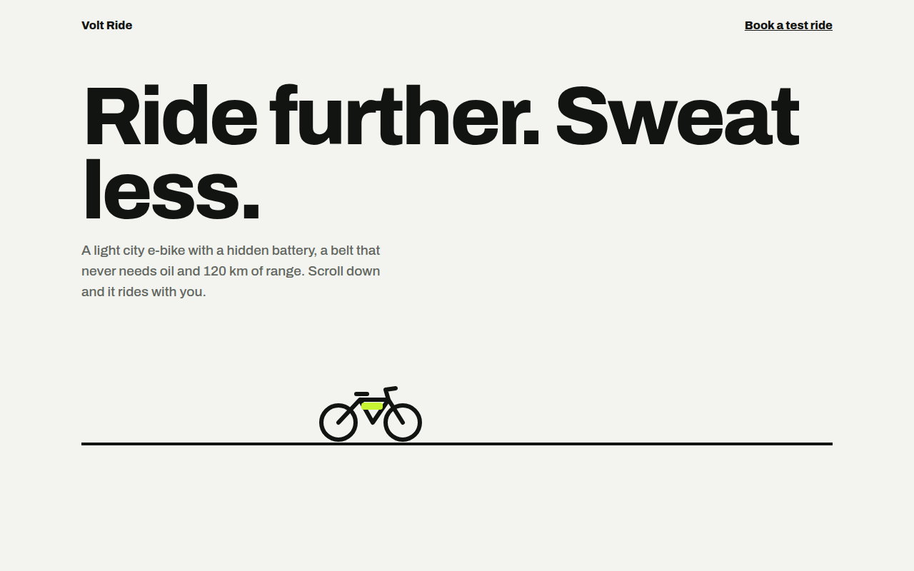

# Scroll Driven Animation CSS Template (Free)



**Live demo:** https://mmrahmanbappi.github.io/100-css-designs/07-motion/061-scroll-driven/demo.html
**Details and code:** https://mmrahmanbappi.github.io/100-css-designs/07-motion/061-scroll-driven/

Free scroll driven animation template for an e-bike. Progress bar, reveals and a bike that rides as you scroll, using CSS animation-timeline. Live demo.

## What is scroll driven animation?

Scroll driven animations link an animation to the scroll position instead of time. Scroll down and the bar fills, cards rise into place and the bike rides across the road. Scroll back up and everything rewinds.

It is pure CSS with animation-timeline: scroll() for the whole page and view() for single elements. Browsers without support, and people who prefer less motion, simply see the finished page.

## What you get

- Reading progress bar with scroll(root)
- Bike that rides as its section passes
- Stat cards that rise with view() and animation-range
- Headline lines that light up one by one
- Safe fallback with @supports and reduced motion

## The key CSS

```css
@supports (animation-timeline: view()) {
  .bar { animation: grow linear both; animation-timeline: scroll(root); }
  @keyframes grow { to { transform: scaleX(1); } }

  .st {
    animation: rise linear both;
    animation-timeline: view();
    animation-range: entry 0% cover 30%;
  }
  @keyframes rise { from { opacity: 0; transform: translateY(60px) scale(.94); } }
}
```

## How to use

1. Download `demo.html` from this folder.
2. Change the text, colors and links.
3. Upload it anywhere. One file, no build step.

## License

MIT. Free for personal and commercial use.
