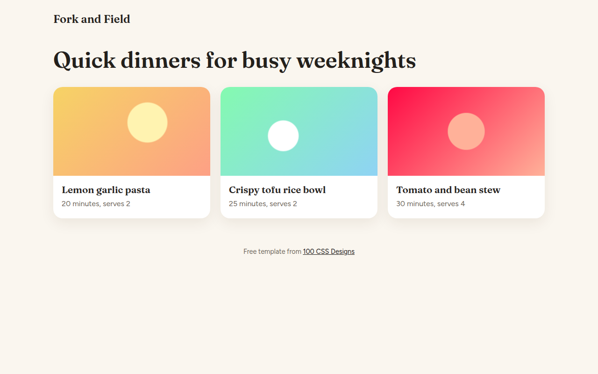

# View Transitions CSS Template (Free)



**Live demo:** https://mmrahmanbappi.github.io/100-css-designs/07-motion/062-view-transitions/demo.html
**Details and code:** https://mmrahmanbappi.github.io/100-css-designs/07-motion/062-view-transitions/

Free View Transitions API template for a recipe site. Click a card and its picture and title morph smoothly into a full recipe view, then back. Live demo.

## What is view transitions?

The View Transitions API lets the browser animate between two states of a page for you. Here, the picture and title of a recipe card grow into the big picture and heading of the recipe page, like a native app.

You wrap the change in document.startViewTransition() and give matching elements the same view-transition-name. The browser takes a snapshot of both states and morphs between them. Where it is not supported, the page simply switches.

## What you get

- Card image and title morph into the detail view
- Smooth reverse when you go back
- Focus moves to the right place for keyboard users
- Works as a normal switch in older browsers
- Turns off for reduced motion

## The key CSS

```css
::view-transition-group(*) {
  animation-duration: .45s;
  animation-timing-function: cubic-bezier(.2, .8, .2, 1);
}

/* JS */
card.querySelector('.pic').style.viewTransitionName = 'hero';
document.startViewTransition(() => {
  detailPic.style.viewTransitionName = 'hero';
  showDetail();
});
```

## How to use

1. Download `demo.html` from this folder.
2. Change the text, colors and links.
3. Upload it anywhere. One file, no build step.

## License

MIT. Free for personal and commercial use.
