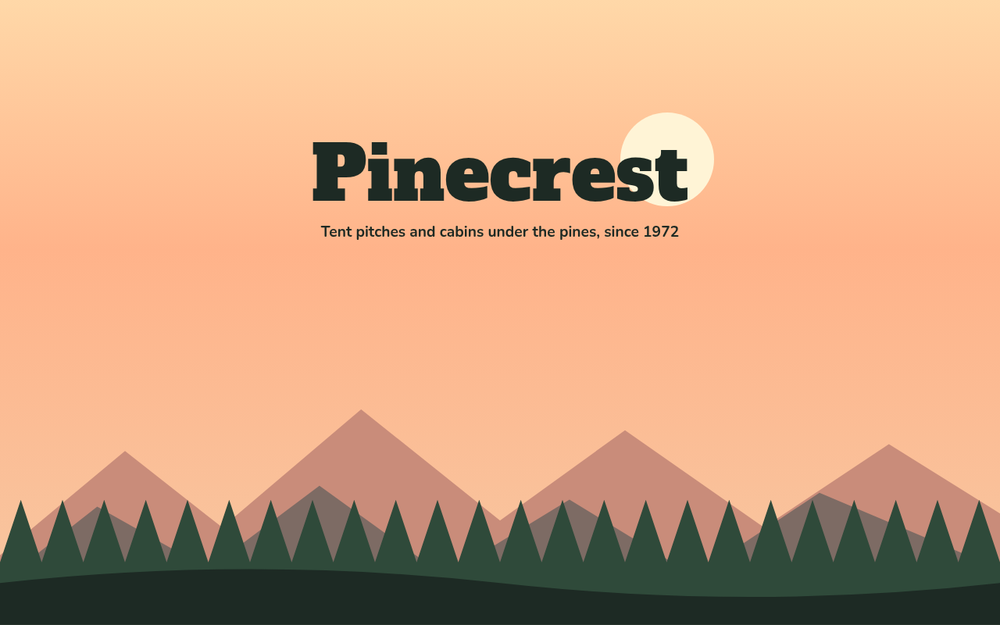

# Layered Parallax CSS Template (Free)



**Live demo:** https://mmrahmanbappi.github.io/100-css-designs/07-motion/064-parallax/demo.html
**Details and code:** https://mmrahmanbappi.github.io/100-css-designs/07-motion/064-parallax/

Free layered parallax website template for a campground. Sun, mountains and trees move at different speeds as you scroll, drawn with SVG. Live demo.

## What is layered parallax?

Layered parallax moves background layers slower than the ones in front, so a flat picture feels deep. As you scroll, the far mountains barely move while the trees slide past, just like looking out of a train window.

Each layer has a speed number. A small script reads the scroll position once per frame and moves each layer by that amount. The layers are SVG shapes, so they stay sharp at any size.

## What you get

- Five layers moving at different speeds
- Mountains and pine trees drawn with SVG
- Smooth updates with requestAnimationFrame
- Speed set per layer with a data attribute
- Parallax off for reduced motion

## The key CSS

```css
.ly { position: absolute; left: 0; right: 0; bottom: 0; will-change: transform; }

/* JS: move each layer by its own speed */
const layers = document.querySelectorAll('[data-s]');
addEventListener('scroll', () => requestAnimationFrame(() => {
  layers.forEach(l => l.style.transform = `translateY(${scrollY * l.dataset.s}px)`);
}), { passive: true });
```

## How to use

1. Download `demo.html` from this folder.
2. Change the text, colors and links.
3. Upload it anywhere. One file, no build step.

## License

MIT. Free for personal and commercial use.
