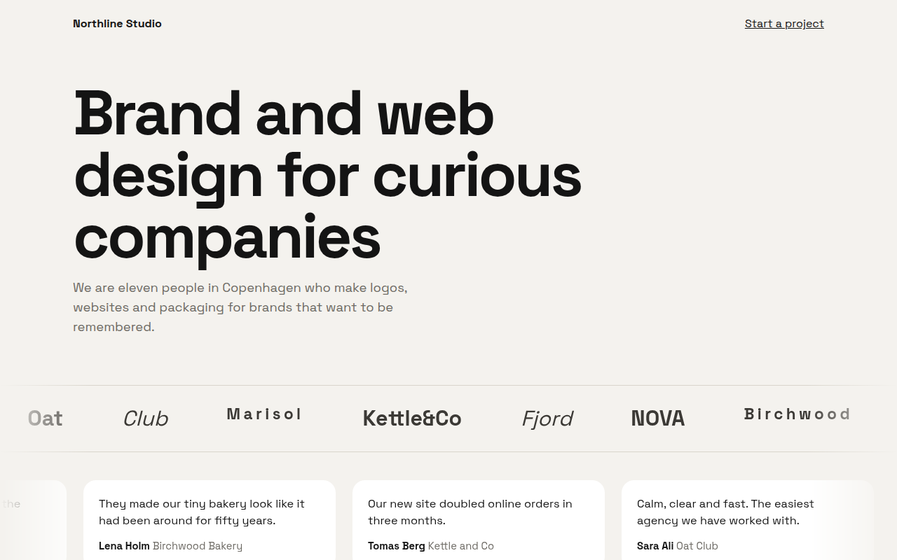

# Marquee Ticker CSS Template (Free)



**Live demo:** https://mmrahmanbappi.github.io/100-css-designs/07-motion/065-marquee/demo.html
**Details and code:** https://mmrahmanbappi.github.io/100-css-designs/07-motion/065-marquee/

Free CSS marquee template for a design studio. Endless scrolling client logos, reviews and a big text line that pause on hover, with faded edges. Live demo.

## What is marquee ticker?

A marquee is a line of content that keeps scrolling sideways forever, like a news ticker. It is a popular way to show client logos, reviews or a big statement without taking much space.

The content is written twice in a row, and the track slides left by exactly half its width, so the loop never shows a gap. It pauses when you hover or tab into it, and the edges fade out with a mask.

## What you get

- Gap free loop by doubling the content
- Pause on hover and keyboard focus
- Faded edges with a CSS mask
- Rows with different speeds and directions
- Stops and wraps for reduced motion

## The key CSS

```css
.mq { overflow: hidden;
  mask: linear-gradient(90deg, transparent, #000 10%, #000 90%, transparent); }
.track { display: flex; width: max-content;
  animation: scroll var(--t, 30s) linear infinite; }
.mq:hover .track { animation-play-state: paused; }
@keyframes scroll { to { transform: translateX(-50%); } }
```

## How to use

1. Download `demo.html` from this folder.
2. Change the text, colors and links.
3. Upload it anywhere. One file, no build step.

## License

MIT. Free for personal and commercial use.
