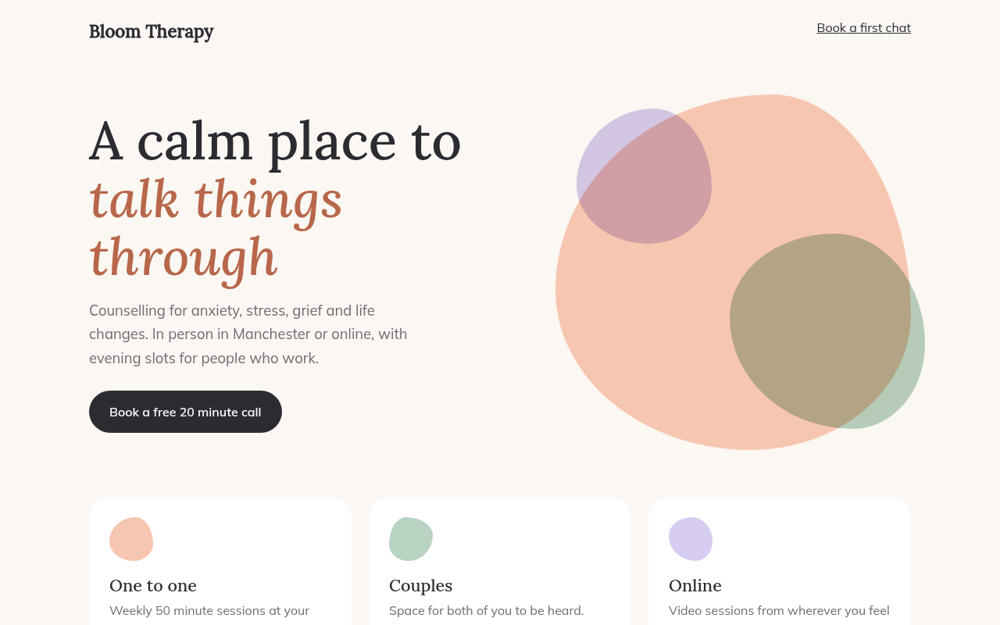

# Morphing Blobs CSS Template (Free)



**Live demo:** https://mmrahmanbappi.github.io/100-css-designs/07-motion/066-morphing-blobs/demo.html
**Details and code:** https://mmrahmanbappi.github.io/100-css-designs/07-motion/066-morphing-blobs/

Free morphing blob template for a therapy practice. Soft shapes slowly change form with animated border-radius and overlap with multiply. Pure CSS. Live demo.

## What is morphing blobs?

Morphing blobs are soft organic shapes that slowly change form, like drops of paint moving in water. They feel calm and human, which is why health, wellness and education brands use them.

The shape comes from border-radius with eight values. A keyframe animation changes those values over 14 seconds. Two blobs overlap with mix-blend-mode: multiply so their colors mix where they meet.

## What you get

- Three overlapping blobs that change shape
- Colors blend where blobs overlap
- Small blob icons on each service card
- Different speeds so they never sync
- Motion stops for reduced motion

## The key CSS

```css
.blob {
  border-radius: 42% 58% 63% 37% / 41% 45% 55% 59%;
  animation: morph 14s ease-in-out infinite;
}
@keyframes morph {
  25% { border-radius: 61% 39% 45% 55% / 55% 62% 38% 45%; }
  50% { border-radius: 37% 63% 56% 44% / 64% 40% 60% 36%; }
  75% { border-radius: 55% 45% 34% 66% / 43% 58% 42% 57%; }
}
```

## How to use

1. Download `demo.html` from this folder.
2. Change the text, colors and links.
3. Upload it anywhere. One file, no build step.

## License

MIT. Free for personal and commercial use.
