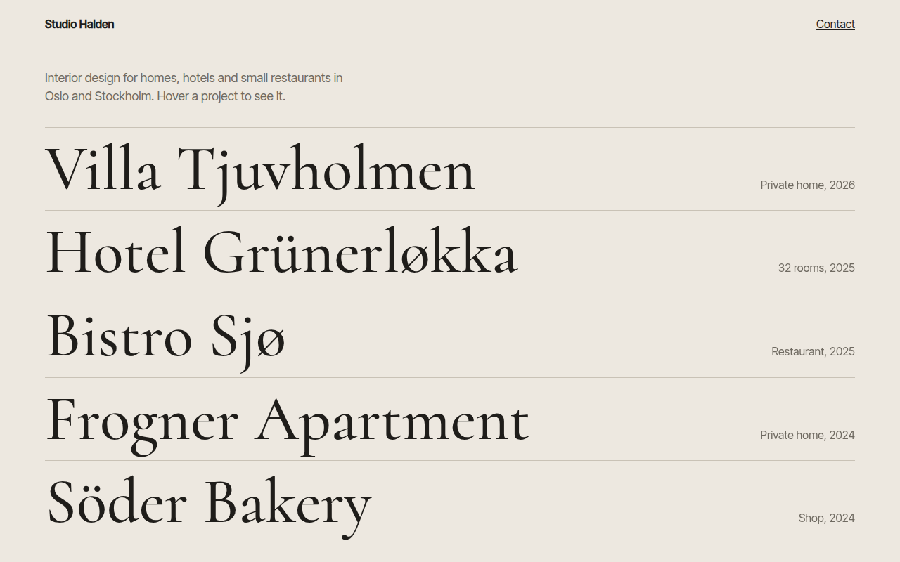

# Hover Reveal CSS Template (Free)



**Live demo:** https://mmrahmanbappi.github.io/100-css-designs/07-motion/067-hover-reveal/demo.html
**Details and code:** https://mmrahmanbappi.github.io/100-css-designs/07-motion/067-hover-reveal/

Free hover reveal template for an interior design studio. Hover a project name and its picture fades in and smoothly follows your cursor. Live demo.

## What is hover reveal?

Hover reveal keeps a page clean with just a list of big names. When you hover one, its picture appears next to your cursor and glides along with it, and the other names fade back.

The picture is one fixed element. A tiny script moves it toward the cursor a little each frame, which gives it that smooth, slightly lazy follow. On touch screens the picture stays hidden and the list works as normal links.

## What you get

- Big serif project names in a list
- Picture fades in and follows the cursor smoothly
- Other items dim while one is hovered
- Name shifts and turns italic on hover and focus
- Hidden on touch devices

## The key CSS

```css
.pv {
  position: fixed; width: 300px; height: 380px; pointer-events: none;
  opacity: 0; transform: translate(-50%, -50%) scale(.85);
  transition: opacity .25s, transform .25s;
}
.pv.on { opacity: 1; transform: translate(-50%, -50%) scale(1); }
.list:hover a:not(:hover) h2 { opacity: .35; }
```

## How to use

1. Download `demo.html` from this folder.
2. Change the text, colors and links.
3. Upload it anywhere. One file, no build step.

## License

MIT. Free for personal and commercial use.
