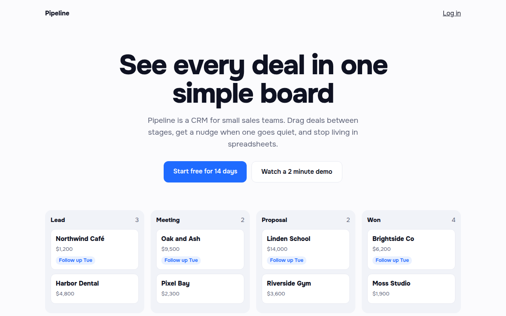

# Staggered Entrance CSS Template (Free)



**Live demo:** https://mmrahmanbappi.github.io/100-css-designs/07-motion/068-staggered-entrance/demo.html
**Details and code:** https://mmrahmanbappi.github.io/100-css-designs/07-motion/068-staggered-entrance/

Free staggered entrance template for a CRM landing page. Headline words, buttons and board cards appear one after another on load. Pure CSS. Live demo.

## What is staggered entrance?

A staggered entrance brings the page in piece by piece on load instead of all at once. The headline builds word by word, then the text, the buttons, and finally each card on the board.

Every element gets a number in a CSS variable, and animation-delay multiplies it. One animation, one rule, and the order is set right in the HTML.

## What you get

- Headline that appears one word at a time
- Delay order set with a --d number per element
- Kanban board cards that land in sequence
- One shared keyframe for everything
- Everything shows at once for reduced motion

## The key CSS

```css
.in {
  opacity: 0;
  animation: enter .7s cubic-bezier(.2, .8, .2, 1) forwards;
  animation-delay: calc(var(--d, 0) * 90ms + 100ms);
}
@keyframes enter {
  from { opacity: 0; transform: translateY(22px); }
  to   { opacity: 1; transform: none; }
}
```

## How to use

1. Download `demo.html` from this folder.
2. Change the text, colors and links.
3. Upload it anywhere. One file, no build step.

## License

MIT. Free for personal and commercial use.
