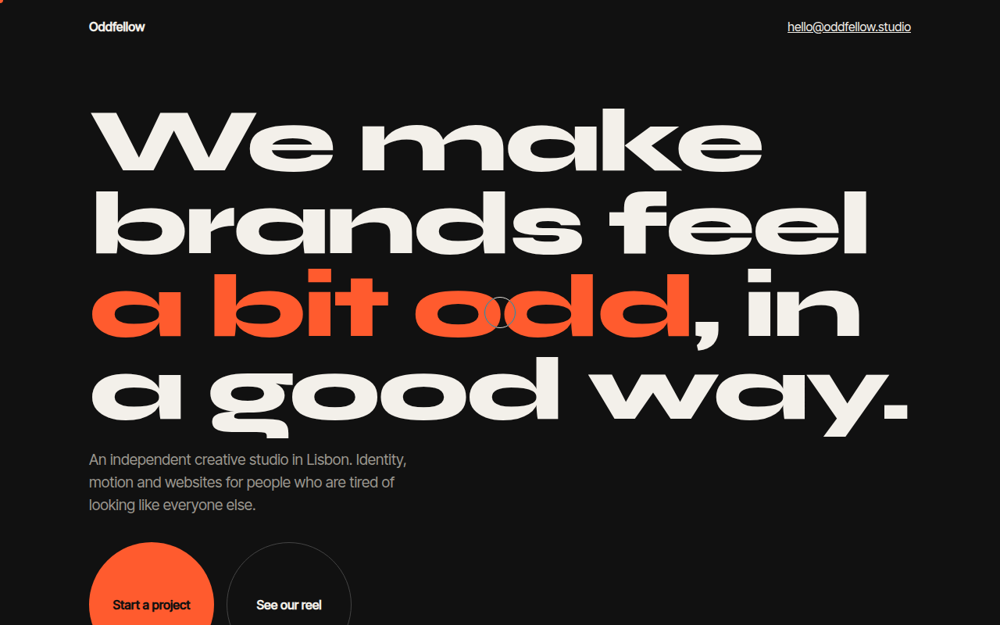

# Cursor Effects CSS Template (Free)



**Live demo:** https://mmrahmanbappi.github.io/100-css-designs/07-motion/070-cursor-effects/demo.html
**Details and code:** https://mmrahmanbappi.github.io/100-css-designs/07-motion/070-cursor-effects/

Free custom cursor template for a creative studio. A smooth following ring, a dot, magnetic buttons and a cursor that grows over links. Live demo.

## What is cursor effects?

Cursor effects replace the normal arrow with your own design. Here a small dot follows the mouse exactly and a ring follows a little behind, then grows and inverts the colors when you point at a link.

The round buttons are magnetic: move near them and they lean toward the cursor. It is a small touch, but it makes a studio site feel crafted. Touch screens keep the normal behavior.

## What you get

- Dot plus smooth trailing ring cursor
- Ring grows and inverts colors over links
- Magnetic buttons that follow the pointer
- Only on devices with a fine pointer
- Keeps normal focus rings for keyboard users

## The key CSS

```css
.ring {
  position: fixed; left: 0; top: 0; pointer-events: none;
  width: 40px; height: 40px; border-radius: 50%;
  border: 1.5px solid #f3f0ea; transform: translate(-50%, -50%);
  mix-blend-mode: difference;
  transition: width .25s, height .25s, background .25s;
}
.ring.big { width: 90px; height: 90px; background: #f3f0ea; }
@media (hover: none), (pointer: coarse) { .ring, .dot { display: none; } }
```

## How to use

1. Download `demo.html` from this folder.
2. Change the text, colors and links.
3. Upload it anywhere. One file, no build step.

## License

MIT. Free for personal and commercial use.
