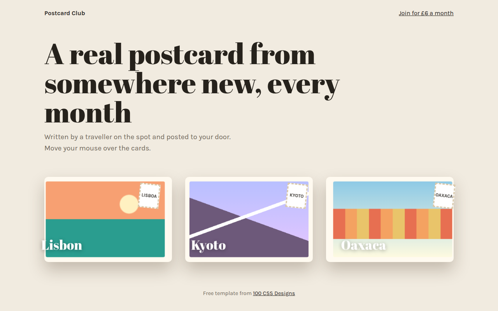

# 3D Tilt Cards CSS Template (Free)



**Live demo:** https://mmrahmanbappi.github.io/100-css-designs/08-3d-depth/071-3d-tilt-cards/demo.html
**Details and code:** https://mmrahmanbappi.github.io/100-css-designs/08-3d-depth/071-3d-tilt-cards/

Free 3D tilt card template for a postcard subscription. Cards lean toward your cursor with a moving glare and layers that pop out in depth. Live demo.

## What is 3d tilt cards?

A 3D tilt card leans toward your mouse as if you were holding it and turning it in the light. A soft glare moves across the surface, and parts of the card, like the stamp and the city name, float at different depths.

It needs no library. A few lines of JavaScript turn the cursor position into rotateX and rotateY values, and transform-style: preserve-3d with translateZ lifts the inner layers off the card.

## What you get

- Tilt that follows the cursor on each card
- Moving glare with a radial gradient
- Stamp and title raised with translateZ
- Smooth return when the cursor leaves
- Tilt off for reduced motion

## The key CSS

```css
.row { perspective: 1000px; }
.card {
  transform-style: preserve-3d;
  transform: rotateX(var(--rx)) rotateY(var(--ry));
  transition: transform .3s ease-out;
}
.card::after {
  content: ""; position: absolute; inset: 0; border-radius: inherit;
  background: radial-gradient(circle at var(--gx) var(--gy), rgba(255,255,255,.45), transparent 50%);
}
.name { transform: translateZ(60px); }
```

## How to use

1. Download `demo.html` from this folder.
2. Change the text, colors and links.
3. Upload it anywhere. One file, no build step.

## License

MIT. Free for personal and commercial use.
