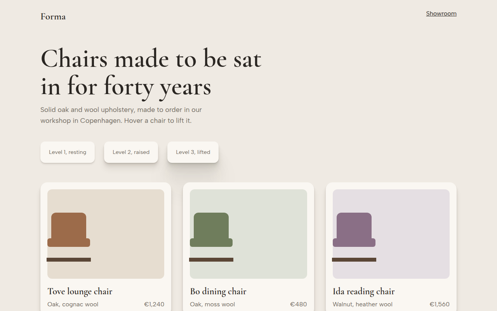

# Layered Shadows CSS Template (Free)



**Live demo:** https://mmrahmanbappi.github.io/100-css-designs/08-3d-depth/073-layered-shadows/demo.html
**Details and code:** https://mmrahmanbappi.github.io/100-css-designs/08-3d-depth/073-layered-shadows/

Free layered shadows template for a furniture shop. Realistic multi layer box shadows in three elevation levels that lift cards on hover. Live demo.

## What is layered shadows?

A single box shadow often looks fake, like a grey smudge. Real shadows are soft far away and sharper close to the object. Stacking several small shadows, each twice as big as the last, gives that natural look.

This template has three elevation levels you can reuse. The shadow color is a warm brown instead of black, so it matches the page. Hover a chair card and it rises to the highest level.

## What you get

- Three reusable elevation levels
- Up to seven stacked shadow layers
- Warm shadow color tuned to the background
- Cards lift and deepen on hover
- Chairs drawn with CSS

## The key CSS

```css
:root { --sh: 30deg 20% 20%; }
.e3 {
  box-shadow:
    0 1px 1px hsl(var(--sh) / .07), 0 2px 2px hsl(var(--sh) / .07),
    0 4px 4px hsl(var(--sh) / .07), 0 8px 8px hsl(var(--sh) / .07),
    0 16px 16px hsl(var(--sh) / .07), 0 32px 32px hsl(var(--sh) / .07),
    0 64px 64px hsl(var(--sh) / .07);
}
```

## How to use

1. Download `demo.html` from this folder.
2. Change the text, colors and links.
3. Upload it anywhere. One file, no build step.

## License

MIT. Free for personal and commercial use.
