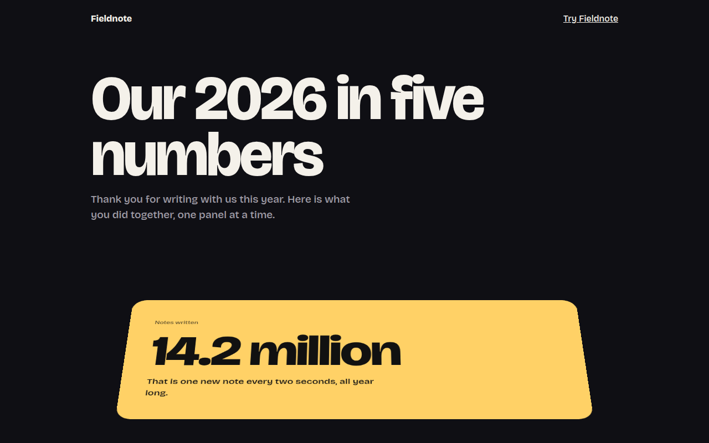

# Perspective Scroll CSS Template (Free)



**Live demo:** https://mmrahmanbappi.github.io/100-css-designs/08-3d-depth/075-perspective-scroll/demo.html
**Details and code:** https://mmrahmanbappi.github.io/100-css-designs/08-3d-depth/075-perspective-scroll/

Free perspective scroll template for a year in review page. Big stat panels tip back in 3D and flatten out as they reach the middle of the screen. Live demo.

## What is perspective scroll?

Perspective scroll makes panels tilt back in 3D as they come up from the bottom of the screen, then lie flat when they reach the middle. It feels like pages of a book being laid down in front of you.

The parent has perspective, and each panel rotates on its bottom edge. A small script works out how far each panel is from the center of the screen and sets the angle, once per frame.

## What you get

- Panels that tip back and flatten on scroll
- Rotation hinged on the bottom edge
- Slight scale for extra depth
- Updates once per frame with requestAnimationFrame
- Flat and still for reduced motion

## The key CSS

```css
.stage { perspective: 1200px; }
.pn {
  transform: rotateX(var(--r)) scale(var(--s));
  transform-origin: 50% 100%;
  will-change: transform;
}
/* JS: d = distance from screen center, -1 to 1 */
/* --r = d > 0 ? d * 38deg : d * -12deg */
```

## How to use

1. Download `demo.html` from this folder.
2. Change the text, colors and links.
3. Upload it anywhere. One file, no build step.

## License

MIT. Free for personal and commercial use.
