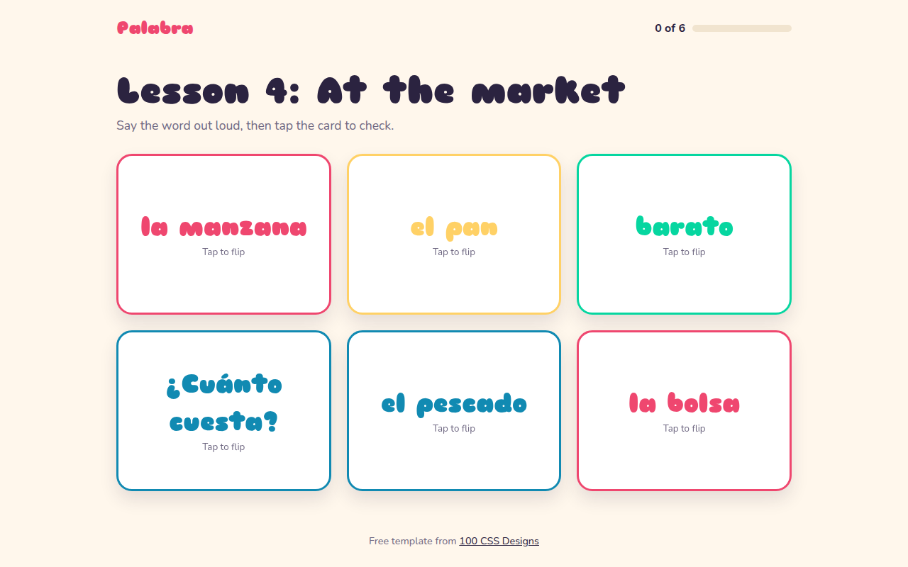

# Flip Cards CSS Template (Free)



**Live demo:** https://mmrahmanbappi.github.io/100-css-designs/08-3d-depth/076-flip-cards/demo.html
**Details and code:** https://mmrahmanbappi.github.io/100-css-designs/08-3d-depth/076-flip-cards/

Free 3D flip card template for a language app. Click or press Enter to flip a flashcard and see the answer on the back, with a progress bar. Live demo.

## What is flip cards?

Flip cards have a front and a back, and turn over in 3D when you click them. They are perfect for flashcards, team profiles and product details.

Both faces sit on top of each other with backface-visibility: hidden, and the back starts turned 180 degrees. Flipping the inner wrapper shows one face and hides the other. The cards are real buttons, so they work with the keyboard.

## What you get

- Smooth 3D flip with a small bounce
- Real buttons with aria-pressed
- Works with click, tap, Enter and Space
- Progress bar counts cards you have seen
- Front and back use lang for correct pronunciation

## The key CSS

```css
.deck { perspective: 1000px; }
.in { transform-style: preserve-3d; transition: transform .6s cubic-bezier(.3, 1.3, .6, 1); }
.fc[aria-pressed="true"] .in { transform: rotateY(180deg); }
.face { position: absolute; inset: 0; backface-visibility: hidden; }
.back { transform: rotateY(180deg); }
```

## How to use

1. Download `demo.html` from this folder.
2. Change the text, colors and links.
3. Upload it anywhere. One file, no build step.

## License

MIT. Free for personal and commercial use.
