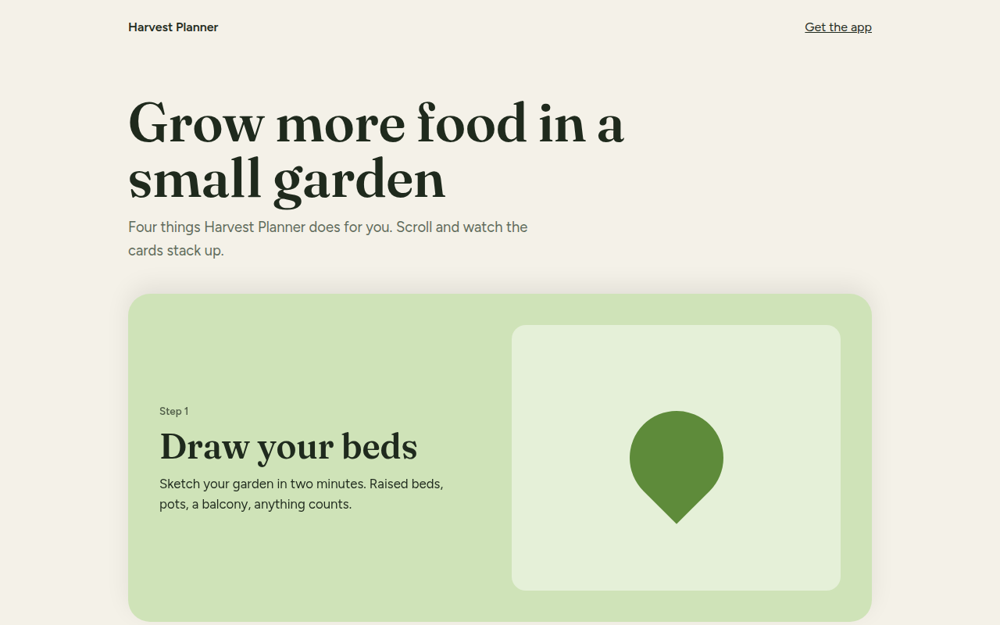

# Stacked Scroll Cards CSS Template (Free)



**Live demo:** https://mmrahmanbappi.github.io/100-css-designs/08-3d-depth/080-stacked-cards/demo.html
**Details and code:** https://mmrahmanbappi.github.io/100-css-designs/08-3d-depth/080-stacked-cards/

Free stacked cards template for a garden planner app. Cards pin in place and stack on top of each other as you scroll, using only position sticky. Live demo.

## What is stacked scroll cards?

Stacked scroll cards pin to the top of the screen one after another, each landing slightly lower than the last, so you end up with a neat pile. It is a clean way to walk through steps or features.

There is no JavaScript at all. Every card is position: sticky with a top value that grows by 28 pixels per card, set with one custom property. The browser does the stacking as you scroll.

## What you get

- Cards that stick and stack with no JavaScript
- Offset per card set with --i
- Soft shadow on each card edge
- Four step layout with text and art
- Works on phones too

## The key CSS

```css
.sc {
  position: sticky;
  top: calc(80px + var(--i) * 28px);
  height: 420px;
  border-radius: 28px;
  margin-bottom: 60px;
  box-shadow: 0 -10px 30px rgba(0, 0, 0, .08);
}
```

## How to use

1. Download `demo.html` from this folder.
2. Change the text, colors and links.
3. Upload it anywhere. One file, no build step.

## License

MIT. Free for personal and commercial use.
