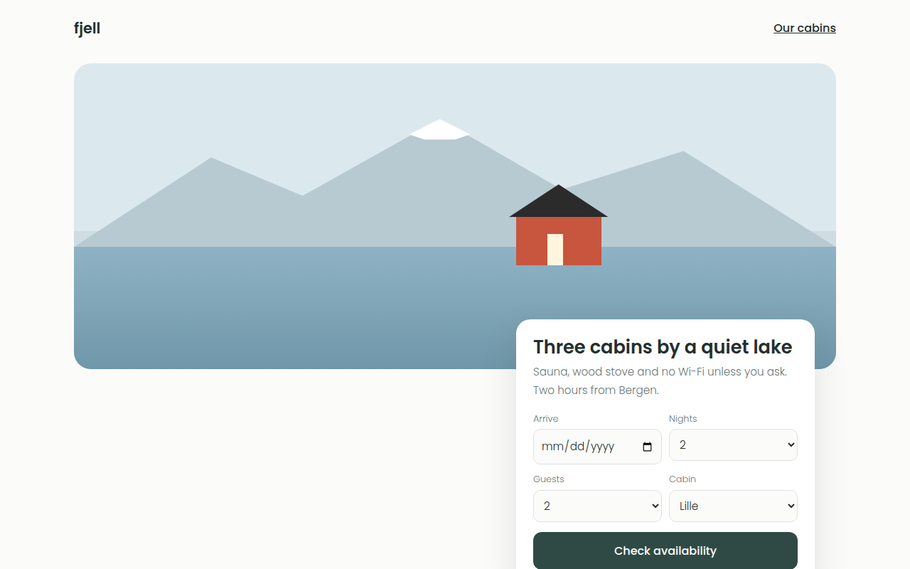

# Scandinavian CSS Template (Free)



**Live demo:** https://mmrahmanbappi.github.io/100-css-designs/09-cultural-aesthetic/082-scandinavian/demo.html
**Details and code:** https://mmrahmanbappi.github.io/100-css-designs/09-cultural-aesthetic/082-scandinavian/

Free Scandinavian design template for cabin rentals. Light birch tones, white space, fjord blues, a CSS cabin scene and a booking card. Live demo.

## What is scandinavian?

Scandinavian design is light, clean and friendly. White and birch backgrounds, soft blues, rounded corners and simple sans serif type, with one warm color like a red cabin to add life.

The hero scene is pure CSS: mountains made with clip-path, a snowy peak, a lake and a red cabin with a lit door. A booking card overlaps the picture, so the most important action is right there.

## What you get

- Mountain and lake scene built with CSS shapes
- Booking card that overlaps the hero
- Working form with a confirmation message
- Birch colored feature cards
- Light Poppins type throughout

## The key CSS

```css
.mtn { clip-path: polygon(0 100%, 18% 30%, 30% 60%, 48% 0, 64% 55%, 80% 25%, 100% 100%); }
.cabin { width: 120px; height: 70px; background: #c8553d; }
.cabin::before {
  content: ""; position: absolute; left: -10px; right: -10px; top: -44px; height: 46px;
  background: #2b2b2b; clip-path: polygon(50% 0, 100% 100%, 0 100%);
}
.book { margin: -70px 30px 0 auto; border-radius: 20px; box-shadow: 0 20px 50px rgba(35,48,46,.12); }
```

## How to use

1. Download `demo.html` from this folder.
2. Change the text, colors and links.
3. Upload it anywhere. One file, no build step.

## License

MIT. Free for personal and commercial use.
