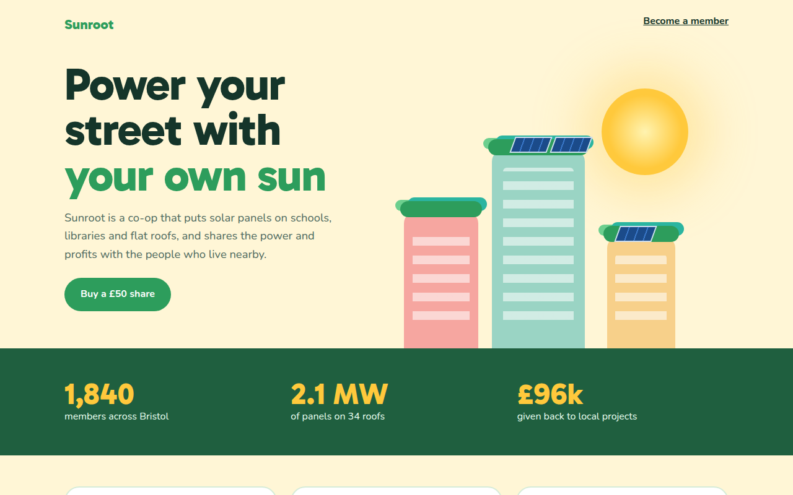

# Solarpunk CSS Template (Free)



**Live demo:** https://mmrahmanbappi.github.io/100-css-designs/09-cultural-aesthetic/086-solarpunk/demo.html
**Details and code:** https://mmrahmanbappi.github.io/100-css-designs/09-cultural-aesthetic/086-solarpunk/

Free solarpunk website template for a community solar co-op. Bright greens, a warm sun, buildings with rooftop gardens and solar panels in CSS. Live demo.

## What is solarpunk?

Solarpunk imagines a bright, green future where cities are full of plants and powered by the sun. It is the opposite of gloomy sci fi: warm, colorful and hopeful.

The city is built from rounded CSS buildings with gardens on every roof and solar panels made with a striped gradient and a skew. A glowing sun and big friendly numbers do the rest.

## What you get

- CSS city with rooftop gardens
- Solar panels made with a skewed striped gradient
- Glowing sun with a soft halo
- Big impact numbers on a green band
- Three step how it works cards

## The key CSS

```css
.bld { border-radius: 18px 18px 0 0; background: var(--c); }
.bld::before {
  content: ""; position: absolute; left: -6px; right: -6px; top: -18px; height: 26px;
  border-radius: 30px; background: #2d9d5c;
  box-shadow: 10px -8px 0 -2px #2bb5a0, -12px -6px 0 -4px #6ccf8e;
}
.panel { background: repeating-linear-gradient(90deg, #1b4b8a 0 13px, #3a78c9 13px 15px); transform: skewX(-20deg); }
```

## How to use

1. Download `demo.html` from this folder.
2. Change the text, colors and links.
3. Upload it anywhere. One file, no build step.

## License

MIT. Free for personal and commercial use.
