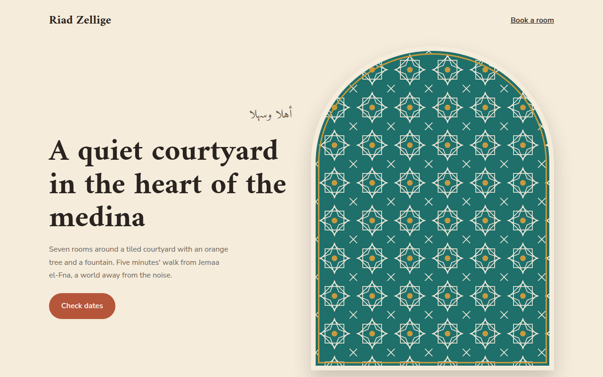

# Islamic Geometric CSS Template (Free)



**Live demo:** https://mmrahmanbappi.github.io/100-css-designs/09-cultural-aesthetic/089-islamic-geometric/demo.html
**Details and code:** https://mmrahmanbappi.github.io/100-css-designs/09-cultural-aesthetic/089-islamic-geometric/

Free Islamic geometric pattern template for a riad in Marrakech. Eight point star tiles, pointed arches and zellige colors made with SVG and CSS. Live demo.

## What is islamic geometric?

Islamic geometric patterns are built from stars and polygons that repeat forever, as seen in the zellige tiles of Morocco and the mosques of Andalusia and Persia. They are calm, precise and endlessly detailed.

The tile here is a small SVG with an eight point star made from two overlapping squares, repeated as a background. Arches are made with border-radius, and the colors come from Moroccan tiles: teal, blue, terracotta and gold.

## What you get

- Eight point star tile pattern as an inline SVG
- Pointed arch frames with border-radius
- Gold zigzag band between sections
- Arabic greeting with correct lang and dir
- Room cards shaped like doorways

## The key CSS

```css
.tile {
  background-color: #1f6f6b;
  background-image: url("data:image/svg+xml,...two rotated squares and a star...");
  background-size: 80px 80px;
}
.arch {
  border-radius: 50% 50% 0 0 / 36% 36% 0 0;
  border: 10px solid #f5ecdc;
  outline: 3px solid #c99a3b; outline-offset: -18px;
}
```

## How to use

1. Download `demo.html` from this folder.
2. Change the text, colors and links.
3. Upload it anywhere. One file, no build step.

## License

MIT. Free for personal and commercial use.
