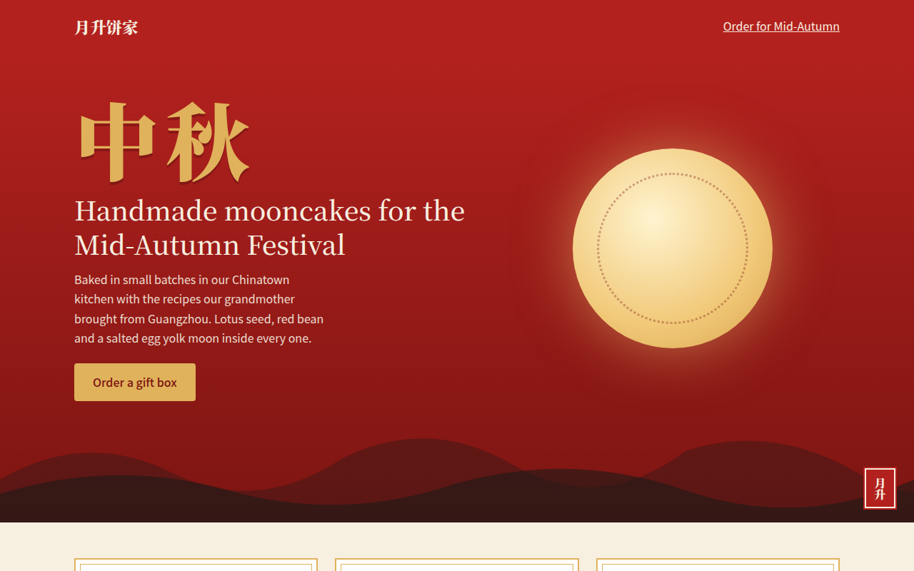

# Guochao CSS Template (Free)



**Live demo:** https://mmrahmanbappi.github.io/100-css-designs/09-cultural-aesthetic/090-guochao/demo.html
**Details and code:** https://mmrahmanbappi.github.io/100-css-designs/09-cultural-aesthetic/090-guochao/

Free guochao website template for a mooncake bakery. Modern Chinese style with red and gold, ink wash mountains, cloud patterns and a seal stamp. Live demo.

## What is guochao?

Guochao, meaning national trend, is the modern Chinese style used by young brands in China today. It takes traditional elements, like red and gold, clouds, mountains in ink and seal stamps, and gives them a clean, modern layout.

Here it celebrates the Mid-Autumn Festival. The moon is a radial gradient, the mountains are two layered SVG curves, the clouds are a repeating SVG pattern and the red seal uses vertical Chinese text.

## What you get

- Red and gold palette with jade accents
- Big Chinese headline in Noto Serif SC
- Ink wash mountain layers in SVG
- Cloud pattern and vertical seal stamp
- Mooncake product cards with double gold frames

## The key CSS

```css
:root { --red: #b3211e; --deep: #7c1512; --gold: #e0b25b; --paper: #f7efe0; }
.zh { font-family: "Noto Serif SC", serif; font-weight: 900; color: var(--gold); letter-spacing: .08em; }
.moon { border-radius: 50%;
  background: radial-gradient(circle at 40% 35%, #fff4d0, #f1c979 60%, #d9a24b);
  box-shadow: 0 0 80px rgba(240, 200, 120, .5); }
.seal { writing-mode: vertical-rl; background: var(--red); outline: 2px solid var(--red); }
```

## How to use

1. Download `demo.html` from this folder.
2. Change the text, colors and links.
3. Upload it anywhere. One file, no build step.

## License

MIT. Free for personal and commercial use.
