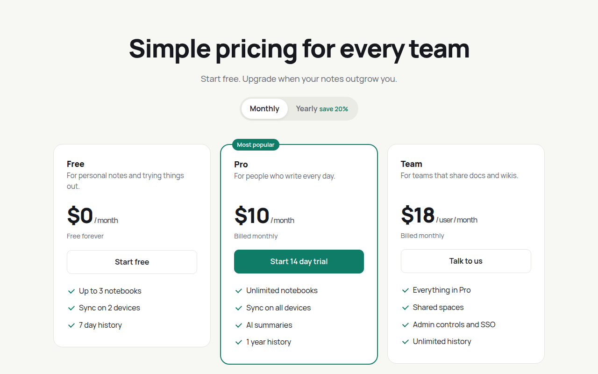

# Pricing Table CSS Template (Free)



**Live demo:** https://mmrahmanbappi.github.io/100-css-designs/10-business-ready/092-pricing-table/demo.html
**Details and code:** https://mmrahmanbappi.github.io/100-css-designs/10-business-ready/092-pricing-table/

Free pricing table template with a working monthly and yearly toggle, three plans, a featured tier and a full feature comparison table. Live demo.

## What is pricing table?

A good pricing page helps people choose in seconds. Three plans side by side, the popular one highlighted, and a toggle to see the yearly discount. Below it, a comparison table answers the detailed questions.

The toggle swaps prices and billing notes from data attributes, so you change prices in the HTML without touching the script. The table scrolls sideways on small screens instead of breaking the layout.

## What you get

- Monthly and yearly toggle that updates every price
- Featured plan with a badge and colored border
- Tick lists drawn in CSS
- Full comparison table with accessible headers
- Table scrolls on phones

## The key CSS

```css
.p.f { border: 2px solid #0e7c66; position: relative; }
.p.f::before {
  content: "Most popular";
  position: absolute; top: -13px; left: 24px;
  background: #0e7c66; color: #fff; border-radius: 999px; padding: 3px 10px;
}
.p li::before { width: 10px; height: 6px; border-left: 2px solid #0e7c66; border-bottom: 2px solid #0e7c66; transform: rotate(-45deg); }
```

## How to use

1. Download `demo.html` from this folder.
2. Change the text, colors and links.
3. Upload it anywhere. One file, no build step.

## License

MIT. Free for personal and commercial use.
